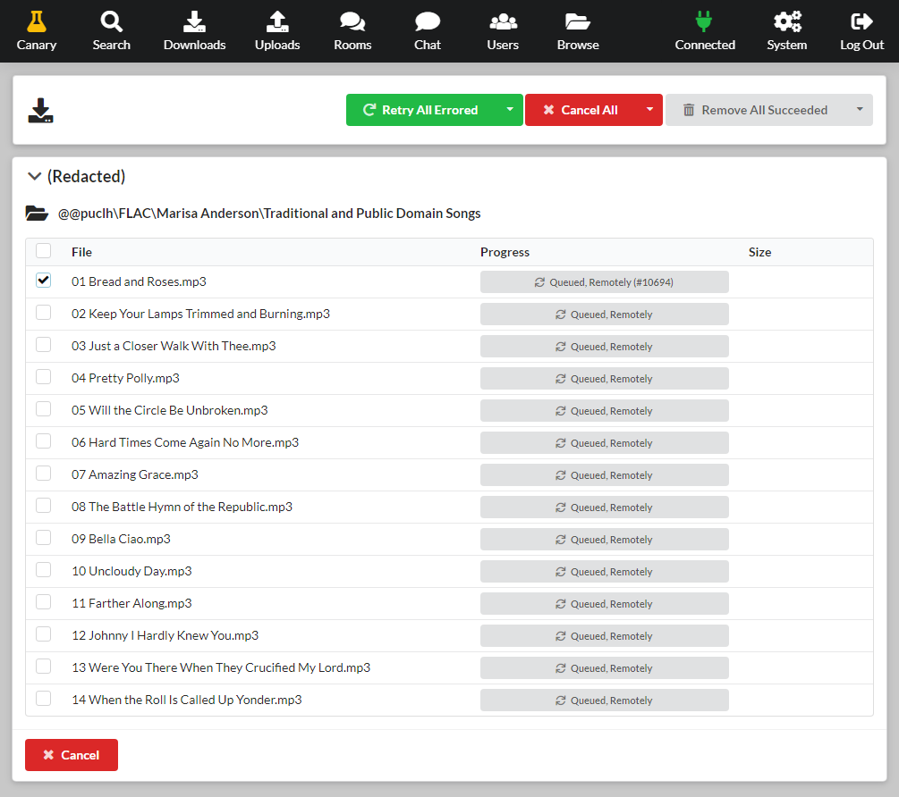

<!-- generated -->

# slskd

1-Click installation template for slskd on Easypanel

## Description

slskd is a modern, web-based client for the Soulseek peer-to-peer file sharing network. It provides a clean, intuitive web interface for browsing, searching, and downloading files from the Soulseek network. Unlike traditional desktop clients, slskd runs as a daemon service that you can access from any device with a web browser. The application supports all core Soulseek features including user searches, room browsing, private messaging, and file sharing. With its containerized deployment, slskd makes it easy to run a persistent Soulseek client on a server or NAS device. It&#39;s perfect for music enthusiasts, collectors, and anyone who wants to participate in the Soulseek community without running a desktop application. The daemon continues to operate even when you&#39;re not actively using the web interface, ensuring you never miss downloads or messages.

## Instructions

Default credentials are slskd/slskd.

## Benefits

- Web-Based Access: Access your Soulseek client from any device with a web browser, no need to install desktop applications or maintain multiple client installations.
- Always-On Operation: Run slskd as a persistent daemon service that continues operating 24/7, ensuring you never miss downloads, uploads, or messages from other users.
- Modern Interface: Enjoy a clean, responsive web interface with modern design and user experience improvements over traditional Soulseek desktop clients.
- Remote Management: Manage your Soulseek activity remotely through the web interface with support for remote configuration and control from anywhere.

## Features

- Soulseek Network Client: Full-featured client for the Soulseek peer-to-peer network supporting all core functionality including searches, downloads, uploads, and messaging.
- Web Interface: Responsive web-based interface accessible from any device with a browser, providing easy access to all Soulseek features without desktop software.
- Search and Browse: Search the Soulseek network for files, browse user libraries, and explore chat rooms to discover new music and content from the community.
- File Sharing: Share your own files with the Soulseek community while downloading from others, maintaining the network's peer-to-peer nature and etiquette.
- Private Messaging: Communicate with other Soulseek users through private messages, discuss music, and build connections within the community.
- Room Support: Join and participate in Soulseek chat rooms to engage with communities around specific music genres, artists, or interests.
- Daemon Mode: Runs as a background service that operates continuously, handling uploads and downloads even when the web interface isn't actively being used.
- Remote Configuration: Configure and manage all aspects of the client remotely through the web interface without needing direct server access or configuration files.

## Links

- [Website](https://slskd.org)
- [Documentation](https://github.com/slskd/slskd/tree/master/docs)
- [GitHub](https://github.com/slskd/slskd)
- [Template Source](https://github.com/easypanel-io/templates/tree/main/templates/slskd)

## Options

Name | Description | Required | Default Value
-|-|-|-
App Service Name | - | yes | slskd
App Service Image | slskd Docker image | yes | slskd/slskd:0.25.1
Torrent Port | - | yes | 5031
Web Port | - | yes | 50300

## Screenshots

## Change Log

- 2025-10-23 – Initial Template Release
- 2026-03-25 – Replaced banner-like screenshot with full upstream web UI screenshot
- 2026-05-05 – Version bumped to 0.25.1

## Contributors

- [Ahson Shaikh](https://github.com/Ahson-Shaikh)
