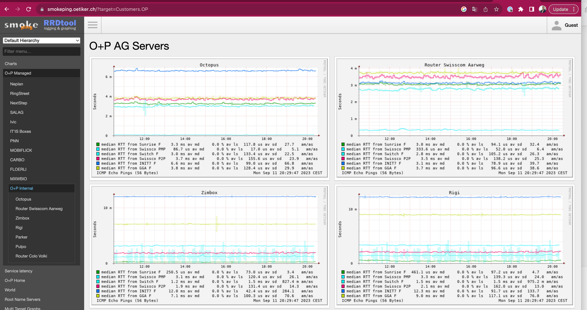

<!-- generated -->

# SmokePing

1-Click installation template for SmokePing on Easypanel

## Description

SmokePing is a powerful open-source tool designed for network monitoring and latency measurement. It provides real-time visualizations of network latency and packet loss, making it easier to identify and diagnose connectivity issues. SmokePing uses ICMP and other protocols to monitor latency across multiple targets and generates detailed graphs to highlight network performance over time. It supports alerting, letting you know when latency or packet loss exceeds predefined thresholds. With its flexible configuration and plugin system, SmokePing can be adapted to various network environments, providing valuable insights into network health and reliability.

## Instructions

You may configure your targets by taking the console from Easypanel

## Benefits

- Real-Time Network Monitoring: SmokePing provides real-time monitoring of network latency and packet loss, enabling quick detection of connectivity issues and bottlenecks.
- Detailed Visualizations: Generate detailed graphs that show latency trends and packet loss over time, providing actionable insights into network performance.
- Customizable Alerts: Configure alerts to notify you when latency or packet loss exceeds predefined thresholds, ensuring you are always informed about potential issues.
- Flexible Configuration: SmokePing supports a wide range of protocols and can be easily configured to monitor multiple network targets and scenarios.
- Open Source and Extensible: SmokePing is open-source and supports plugins, allowing you to extend its functionality to suit your specific network monitoring needs.

## Features

- Latency Measurement: Measure network latency using ICMP and other supported protocols to provide accurate and reliable metrics.
- Packet Loss Tracking: Monitor and visualize packet loss across network targets to identify potential issues affecting connectivity.
- Alerts and Notifications: Set up custom alerts to notify you via email or other methods when network performance drops below acceptable levels.
- Multi-Target Monitoring: Monitor multiple network targets simultaneously, making it suitable for complex network environments.
- Historical Data Retention: Store and analyze historical data to identify trends and recurring issues in your network performance.

## Links

- [Documentation](https://oss.oetiker.ch/smokeping/doc/smokeping_install.en.html)
- [Github](https://github.com/oetiker/SmokePing)
- [Template Source](https://github.com/easypanel-io/templates/tree/main/templates/smokeping)

## Options

Name | Description | Required | Default Value
-|-|-|-
App Service Name | - | yes | smokeping
App Service Image | - | yes | lscr.io/linuxserver/smokeping:2.8.2

## Screenshots

## Change Log

- 2025-01-21 – First Release

## Contributors

- [Ahson Shaikh](https://github.com/Ahson-Shaikh)
