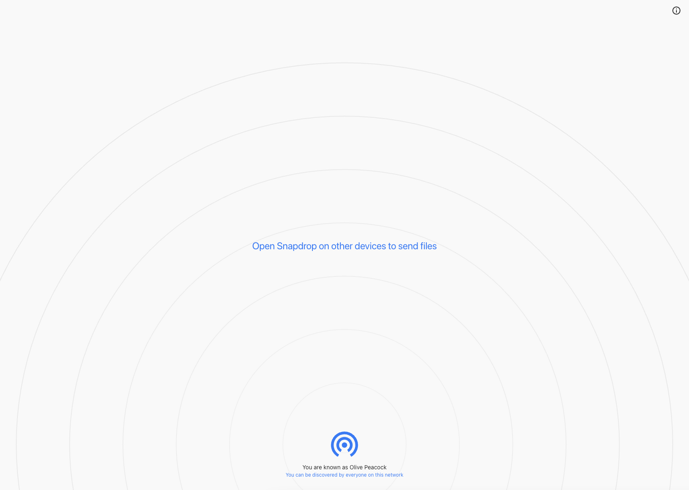

<!-- generated -->

# SnapDrop

1-Click installation template for SnapDrop on Easypanel

## Description

Snapdrop is a self-hosted, browser-based file-sharing platform that allows you to seamlessly transfer files between devices on the same local network. Inspired by Apple&#39;s AirDrop, Snapdrop works across any device and browser without requiring an account or installation. It provides fast, peer-to-peer file transfers using WebRTC, ensuring privacy and efficiency. Snapdrop&#39;s lightweight design ensures minimal resource usage while offering an intuitive user interface for easy file sharing.

## Instructions

Access the Snapdrop service via your browser on devices connected to the same network. Simply drag and drop files to transfer them to other devices detected on the Snapdrop interface.

## Benefits

- Seamless File Sharing: Snapdrop enables fast and seamless file transfers between devices on the same network without needing any accounts or installations.
- Cross-Platform Support: Snapdrop works across all devices and browsers, including mobile phones, tablets, and desktops, ensuring broad compatibility.
- Private and Secure Transfers: File transfers are peer-to-peer over WebRTC, ensuring privacy and no third-party servers for file storage.
- Lightweight and Fast: Snapdrop is lightweight, consumes minimal resources, and delivers efficient file transfers.

## Features

- Peer-to-Peer Transfers: Uses WebRTC for direct peer-to-peer file transfers, bypassing external servers for enhanced privacy.
- Browser-Based Interface: No installation required; simply open the Snapdrop service in any modern browser to start sharing files.
- Multi-Device Detection: Automatically detects other devices on the same network, allowing seamless file transfers between them.
- Drag-and-Drop Functionality: Share files easily by dragging and dropping them into the Snapdrop interface.
- Cross-Browser Compatibility: Snapdrop works on Chrome, Firefox, Safari, Edge, and other major browsers.
- Mobile-Friendly Design: Optimized for mobile devices, allowing you to share files between your phone, tablet, and desktop effortlessly.

## Links

- [Documentation](https://github.com/linuxserver/docker-snapdrop)
- [GitHub](https://github.com/RobinLinus/snapdrop)
- [Template Source](https://github.com/easypanel-io/templates/tree/main/templates/snapdrop)

## Options

Name | Description | Required | Default Value
-|-|-|-
App Service Name | - | yes | snapdrop
App Service Image | - | yes | lscr.io/linuxserver/snapdrop:version-f88d46ed

## Screenshots

## Change Log

- 2024-12-12 – First release

## Contributors

- [Ahson Shaikh](https://github.com/Ahson-Shaikh)
