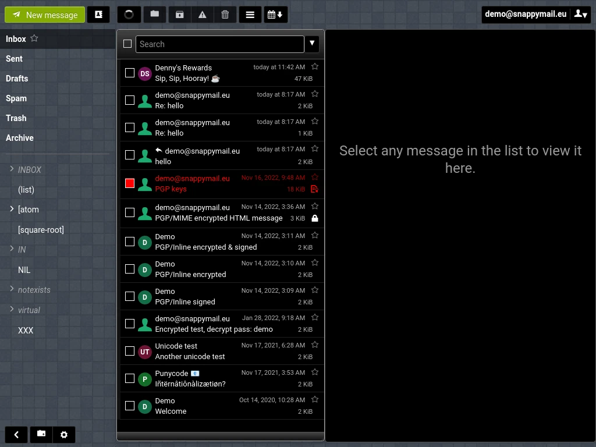

<!-- generated -->

# Snappymail

1-Click installation template for Snappymail on Easypanel

## Description

SnappyMail is a lightweight, fast, and self-hosted webmail client designed for efficient email management. Built with a focus on speed and security, SnappyMail offers a clean user interface, seamless IMAP integration, and multi-account support. It is optimized for both desktop and mobile use, providing a smooth and responsive email experience. SnappyMail supports advanced email features such as PGP encryption, custom folders, and customizable themes. With its self-hosted nature, users maintain full control over their emails, ensuring privacy and security.

## Instructions

Configure SnappyMail with your IMAP server settings for full functionality.

## Benefits

- Fast and Lightweight: SnappyMail is optimized for speed and efficiency, ensuring a smooth and responsive email experience, even on low-resource servers.
- Privacy-Focused: Being self-hosted, SnappyMail ensures complete control over your emails, providing a secure and private email solution.
- Multi-Account Support: Easily manage multiple email accounts within a single SnappyMail instance, improving workflow efficiency.

## Features

- IMAP and SMTP Support: SnappyMail seamlessly integrates with IMAP and SMTP servers, making it compatible with most email providers.
- PGP Encryption: The built-in PGP encryption feature allows users to send and receive encrypted emails for enhanced security.
- Customizable UI: SnappyMail offers various themes and customization options to personalize the email interface.
- Mobile-Friendly Design: The responsive UI adapts to different screen sizes, ensuring a seamless experience across desktop and mobile devices.
- Advanced Email Features: Includes functionalities such as custom folders, message filtering, and auto-completion for improved email management.

## Links

- [Documentation](https://github.com/the-djmaze/snappymail/wiki)
- [Github](https://github.com/the-djmaze/snappymail)
- [Template Source](https://github.com/easypanel-io/templates/tree/main/templates/snappymail)

## Options

Name | Description | Required | Default Value
-|-|-|-
App Service Name | - | yes | snappymail
App Service Image | - | yes | djmaze/snappymail:v2.38.2

## Screenshots

## Change Log

- 2025-01-31 – First Release

## Contributors

- [Ahson Shaikh](https://github.com/Ahson-Shaikh)
