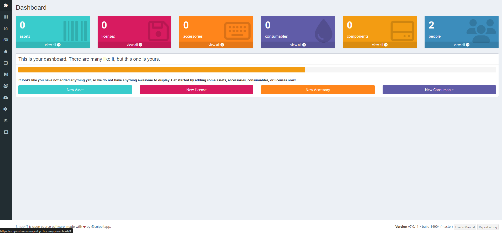

<!-- generated -->

# Snipe-IT

1-Click installation template for Snipe-IT on Easypanel

## Description

Snipe-IT is a powerful, open-source IT asset management system designed to help organizations efficiently manage and track their IT assets. From laptops to licenses, Snipe-IT provides a centralized platform to store, monitor, and manage asset information securely. Unlike traditional asset management systems, Snipe-IT is modern, intuitive, and built for ease of use. It features detailed reporting, asset auditing, and check-in/check-out functionality, ensuring accountability and accuracy for IT teams. Snipe-IT also supports role-based user management and integrates seamlessly with LDAP and SMTP for user authentication and notifications. Whether you&#39;re managing 10 or 10,000 assets, Snipe-IT offers the tools you need to stay organized and improve IT workflow. With robust API support, it can integrate with third-party systems for automation and enhanced reporting. Ideal for businesses of all sizes, Snipe-IT makes IT asset management easy and effective.

## Benefits

- Centralized Asset Management: Snipe-IT provides a single platform to track and manage all IT assets, including hardware, software, and licenses, ensuring improved visibility and control.
- Role-Based Access Control: Snipe-IT supports role-based user management, allowing administrators to define permissions for different users and ensure security.
- Comprehensive Auditing: Snipe-IT maintains an audit log for all asset activities, helping IT teams track changes and ensure accountability.
- Seamless Integration: With API support and LDAP integration, Snipe-IT can easily integrate with existing systems for automation and reporting.
- Check-In/Check-Out Functionality: Easily assign and return assets to users, ensuring assets are tracked efficiently across the organization.

## Features

- Easy Installation: Snipe-IT can be deployed quickly using Docker or manual installation, ensuring a hassle-free setup.
- Real-Time Notifications: Integrate with SMTP to enable real-time email notifications for asset status changes and reminders.
- Flexible Reporting: Generate detailed reports on asset lifecycle, warranty status, and assignments to make data-driven decisions.
- API Support: Snipe-IT provides a robust API to integrate asset management data with third-party systems and automation tools.

## Links

- [Documentation](https://snipe-it.readme.io/)
- [GitHub](https://github.com/snipe/snipe-it)
- [Template Source](https://github.com/easypanel-io/templates/tree/main/templates/snipe-it)

## Options

Name | Description | Required | Default Value
-|-|-|-
App Service Name | - | yes | snipeit
App Service Image | - | yes | snipe/snipe-it:v7.0.11
SMTP Host | - | yes | smtp.example.com
SMTP Port | - | yes | 587
SMTP Username | - | yes | example
SMTP Password | - | yes | 
SMTP From Address | - | yes | you@example.com
SMTP From Name | - | yes | Snipe-IT
SMTP Reply-To Email | - | yes | you@example.com
SMTP Reply-To Name | - | yes | Snipe-IT

## Screenshots

## Change Log

- 2024-12-09 – First release

## Contributors

- [Ahson Shaikh](https://github.com/Ahson-Shaikh)
