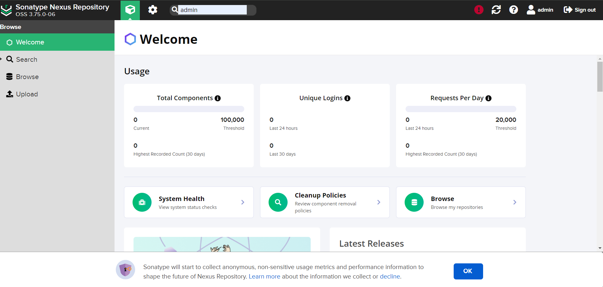

<!-- generated -->

# Sonatype Nexus

1-Click installation template for Sonatype Nexus on Easypanel

## Description

Sonatype Nexus is a powerful repository manager designed to streamline the management and storage of binary components. It enables development teams to efficiently organize, share, and deploy artifacts across various formats, such as Maven, npm, Docker, and more. With its robust feature set and enterprise-grade capabilities, Sonatype Nexus improves DevOps workflows by providing secure, scalable, and centralized storage for software assets.

## Instructions

After logging in without a password, log out and then log back in using the username admin. To get the password, open the container console tab and run the command cat /nexus-data/admin.password. Once logged in, you will be prompted to change the password.

## Benefits

- Centralized Artifact Management: Nexus Repository Manager provides a single source for all your development artifacts, enabling teams to collaborate more efficiently.
- Security and Compliance: Scan your components for vulnerabilities and ensure compliance with security standards using Sonatype integrations.
- Support for Multiple Formats: Manage a wide range of repository formats, including Maven, npm, Docker, PyPI, and more.

## Features

- Repository Management: Organize and control access to software artifacts across different teams and environments.
- Proxy Caching: Reduce build times by caching remote repositories and speeding up dependency resolution.
- Vulnerability Scanning: Integrate with tools like Sonatype Lifecycle to identify and mitigate risks in your dependencies.
- High Availability: Ensure uninterrupted access to your artifacts with clustering and high availability configurations.
- REST API Support: Automate and extend the repository manager's functionality using its comprehensive REST API.

## Links

- [Github](https://github.com/sonatype/nexus-public)
- [Documentation](https://help.sonatype.com/repomanager3)
- [Demo](https://www.sonatype.com/nexus-repository-sonatype)
- [Template Source](https://github.com/easypanel-io/templates/tree/main/templates/sonatype-nexus)

## Options

Name | Description | Required | Default Value
-|-|-|-
App Service Name | - | yes | nexus
App Service Image | - | yes | sonatype/nexus3:3.75.0

## Screenshots

## Change Log

- 2024-12-05 – First Release

## Contributors

- [Ahson Shaikh](https://github.com/Ahson-Shaikh)
