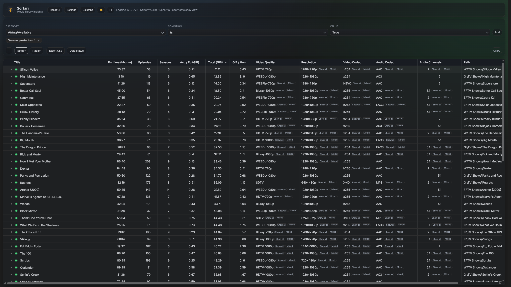

<!-- generated -->

# Sortarr

1-Click installation template for Sortarr on Easypanel

## Description

Sortarr is a read-only analytics and organization tool for Sonarr and Radarr media libraries. It provides a data-driven management layer that helps you identify missing media, mismatches, and optimization opportunities using real playback data from providers like Tautulli, Jellystat, or Plex. Sortarr supports multiple Sonarr and Radarr instances, presents a unified PowerBI-like spreadsheet interface with actionable insights, and never modifies, moves, or renames your media files. All operations are strictly read-only and safe.

## Instructions

On first launch, add your Sonarr/Radarr instances, a history provider (Tautulli, Jellystat, or Plex), and a playback provider (Plex). Test connections, save configuration, and Sortarr will begin analyzing your libraries immediately.

## Benefits

- Read-Only & Safe: Sortarr never modifies, moves, or renames your media files. It never deletes media or changes Sonarr/Radarr configuration. All operations are strictly read-only.
- Data-Driven Insights: Identify missing media, mismatches, and optimization opportunities using real playback data from Tautulli, Jellystat, or Plex.
- Unified Library View: Analyze multiple Sonarr and Radarr instances in a single PowerBI-like spreadsheet interface with filtering, sorting, and actionable insights.

## Features

- Multi-Instance Support: Connect multiple Sonarr and Radarr instances and analyze them in a unified interface with shows and movies views.
- Playback History Integration: Integrate playback data from Tautulli, Jellystat, or Plex to understand viewing patterns and spot underused media.
- Advanced Filtering: Audio and subtitle language columns with filters and quick chips. Sort and filter by any column to find outliers and issues.
- Background Data Refresh: Caches results for performance. Supports background data refresh with live processing indicators.

## Links

- [GitHub](https://github.com/Jaredharper1/Sortarr)
- [Documentation](https://github.com/Jaredharper1/Sortarr/wiki)
- [Template Source](https://github.com/easypanel-io/templates/tree/main/templates/sortarr)

## Options

Name | Description | Required | Default Value
-|-|-|-
App Service Name | - | yes | sortarr
App Service Image | - | yes | ghcr.io/jaredharper1/sortarr:0.8.7

## Screenshots

## Change Log

- 2026-03-17 – Template Release (v0.8.7)

## Contributors

- [Ahson Shaikh](https://github.com/Ahson-Shaikh)
