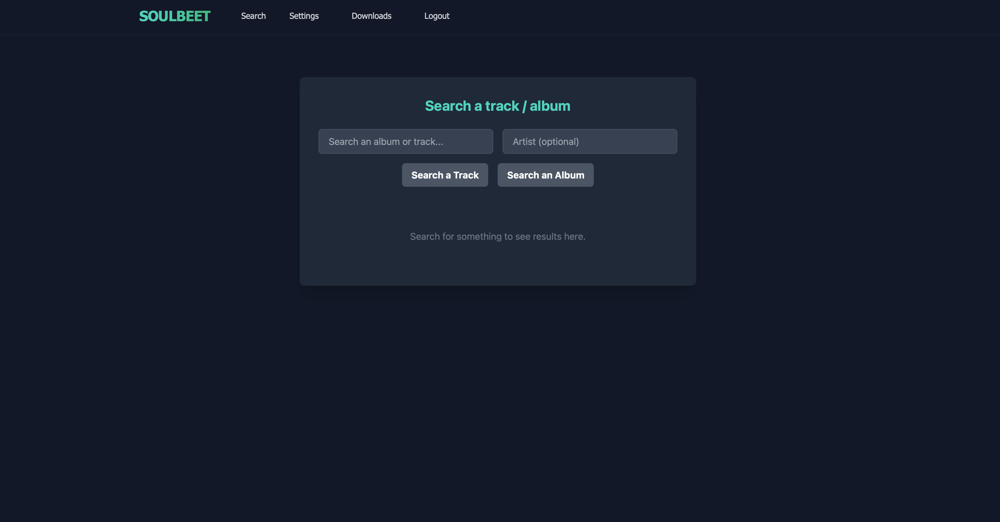

<!-- generated -->

# Soulbeet

1-Click installation template for Soulbeet on Easypanel

## Description

Soulbeet is a self-hosted music management and downloading application that integrates with slskd (Soulseek daemon) and beets to create a seamless music acquisition and organization workflow. The application provides a web interface for searching and downloading music through the Soulseek peer-to-peer network, then automatically organizing your downloads using beets&#39; powerful music library management capabilities. Soulbeet connects to your slskd instance to handle the actual Soulseek network communication, allowing you to search for tracks, browse user shares, and queue downloads. Once files are downloaded, beets integration enables automatic tagging, metadata correction, album art fetching, and file organization based on your configured rules. The application uses SQLite for lightweight data persistence and supports custom beets configurations for advanced music library management. Perfect for music enthusiasts who want to build and maintain a well-organized digital music collection, users looking for a self-hosted alternative to music streaming services, audiophiles who prefer to own their music with proper metadata and organization, or anyone who wants to combine the power of Soulseek&#39;s peer-to-peer network with beets&#39; music library management in a single unified interface.

## Benefits

- Unified Music Workflow: Combine Soulseek downloading with beets organization in a single interface for seamless music acquisition and library management.
- Automatic Organization: Downloaded music is automatically tagged, renamed, and organized using beets' powerful library management capabilities.
- Self-Hosted Privacy: Keep your music collection and downloading activity private on your own infrastructure without relying on streaming services.
- Peer-to-Peer Access: Access the vast Soulseek network to find rare and hard-to-find music not available on mainstream platforms.

## Features

- slskd Integration: Direct integration with slskd for Soulseek network access, searching, browsing shares, and managing downloads.
- Beets Integration: Automatic music library management with beets for tagging, metadata correction, and file organization.
- Web Interface: Clean web-based interface for searching, browsing, and managing your music downloads and library.
- SQLite Database: Lightweight SQLite database for persistent storage of download history, library metadata, and application state.
- Custom Configuration: Support for custom beets configuration files to tailor music organization rules to your preferences.
- Download Management: Queue and manage downloads from the Soulseek network with progress tracking and status updates.
- Music Library: Organize your music collection with proper folder structure, consistent naming, and complete metadata.
- Album Art: Automatic album art fetching and embedding through beets integration for a complete music library experience.

## Links

- [GitHub](https://github.com/terry90/soulbeet)
- [Docker Hub](https://hub.docker.com/r/docccccc/soulbeet)
- [Documentation](https://github.com/terry90/soulbeet#readme)
- [Template Source](https://github.com/easypanel-io/templates/tree/main/templates/soulbeet)

## Options

Name | Description | Required | Default Value
-|-|-|-
App Service Name | - | yes | soulbeet
App Service Image | - | yes | docker.io/docccccc/soulbeet:0.3.4
slskd API Key | - | no | 
Enable Built-in slskd Service | - | no | true

## Screenshots

## Change Log

- 2025-12-10 – Template Release

## Contributors

- [Ahson Shaikh](https://github.com/Ahson-Shaikh)
