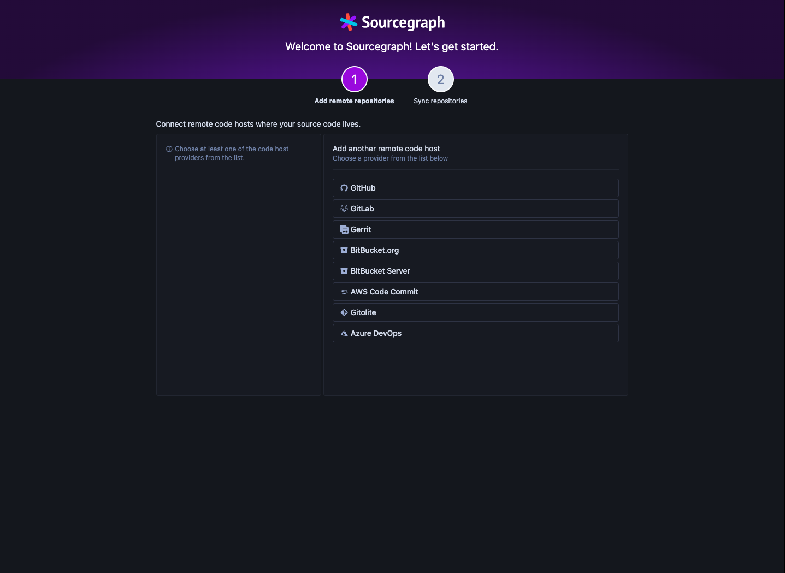

<!-- generated -->

# Sourcegraph

1-Click installation template for Sourcegraph on Easypanel

## Description

Sourcegraph is a universal code search and intelligence platform designed to help developers find, explore, and understand code across all repositories. It enables teams to improve productivity and code quality by providing a centralized interface for searching, navigating, and understanding codebases. Sourcegraph supports multiple version control systems, languages, and integrations, making it a powerful tool for developers, DevOps, and enterprises. With features like code insights, precise code navigation, and batch changes, Sourcegraph enhances collaboration and streamlines development workflows.

## Instructions

Once the server is ready (logo is displayed in the terminal), navigate to the hostname or IP address on port 7080. Create the admin account, then you&#39;ll be guided through setting up Sourcegraph for code searching and navigation.

## Benefits

- Universal Code Search: Sourcegraph provides fast and accurate search capabilities across all your repositories, enabling developers to find and understand code efficiently.
- Multi-Language Support: Sourcegraph supports a wide range of programming languages, offering precise code intelligence for navigating and understanding codebases.
- Enhanced Collaboration: Improve team collaboration with shared code insights, annotations, and streamlined workflows for development and review.

## Features

- Code Search and Navigation: Quickly find code, symbols, and references across all repositories with powerful search and navigation tools.
- Batch Changes: Automate large-scale code changes with batch changes, reducing manual effort and errors.
- Integrations: Seamlessly integrate Sourcegraph with popular tools like GitHub, GitLab, Bitbucket, and others.
- Code Insights: Gain insights into codebases with visual dashboards and analytics to track trends and improve decision-making.
- Security and Compliance: Perform automated searches for security vulnerabilities and compliance issues across repositories.

## Links

- [Github](https://github.com/sourcegraph)
- [Documentation](https://docs.sourcegraph.com)
- [Demo](https://sourcegraph.com)
- [Template Source](https://github.com/easypanel-io/templates/tree/main/templates/sourcegraph)

## Options

Name | Description | Required | Default Value
-|-|-|-
App Service Name | - | yes | sourcegraph
App Service Image | - | yes | sourcegraph/server:5.11.5234

## Screenshots

## Change Log

- 2025-01-21 – First Release

## Contributors

- [Ahson Shaikh](https://github.com/Ahson-Shaikh)
