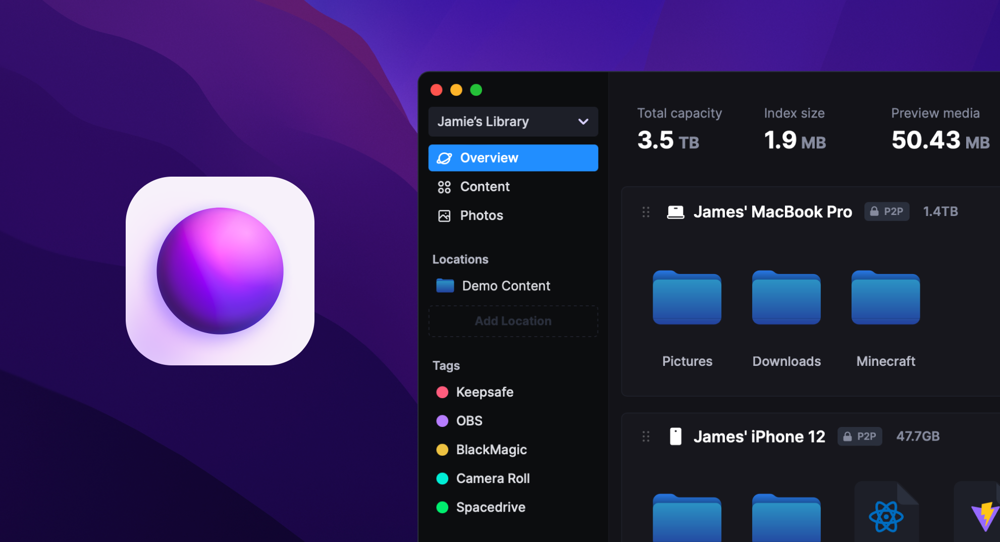

<!-- generated -->

# SpaceDrive

1-Click installation template for SpaceDrive on Easypanel

## Description

SpaceDrive is a powerful storage and file management solution designed to streamline the organization, synchronization, and access of data across multiple devices. It enables users to efficiently manage their files with real-time synchronization, end-to-end encryption, and scalable storage options. With its robust feature set and enterprise-grade capabilities, SpaceDrive enhances productivity by providing secure, distributed, and decentralized storage for personal and professional use.

## Benefits

- Distributed Storage: SpaceDrive provides a decentralized approach to file management, ensuring redundancy and accessibility across multiple devices.
- End-to-End Encryption: Protect your data with robust encryption protocols, keeping your files secure from unauthorized access.
- Cross-Platform Support: Manage and sync files seamlessly across Windows, macOS, Linux, and mobile devices.

## Features

- Real-Time Sync: Keep your files updated across all devices with efficient synchronization technology.
- File Versioning: Access and restore previous versions of files with built-in version control.
- Remote Access: Securely access your files from anywhere with SpaceDrive’s cloud and local storage integration.
- Offline Mode: Work on your files even without an internet connection and sync when connectivity is restored.
- API & Developer Support: Extend functionality with a comprehensive API, allowing integrations with third-party applications and services.

## Links

- [Github](https://github.com/spacedriveapp/spacedrive)
- [Documentation](https:/spacedrive.com)
- [Template Source](https://github.com/easypanel-io/templates/tree/main/templates/spacedrive)

## Options

Name | Description | Required | Default Value
-|-|-|-
App Service Name | - | yes | spacedrive
App Service Image | - | yes | ghcr.io/spacedriveapp/spacedrive/server:0.4.2
Username | - | yes | spacedrive
Password | - | yes | password

## Screenshots

## Change Log

- 2025-01-30 – First Release

## Contributors

- [Ahson Shaikh](https://github.com/Ahson-Shaikh)
