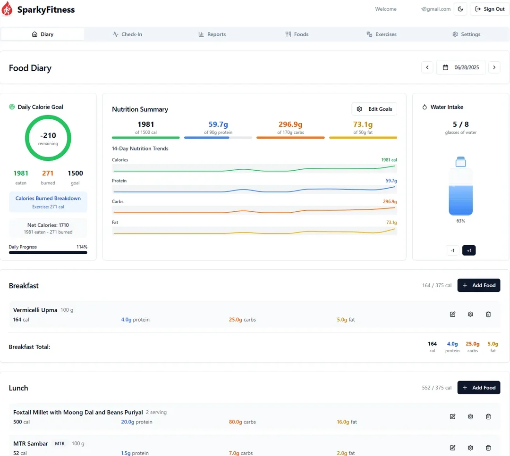

<!-- generated -->

# SparkyFitness

1-Click installation template for SparkyFitness on Easypanel

## Description

SparkyFitness is a self-hosted, privacy-first alternative to MyFitnessPal. Track nutrition, exercise, hydration, and body metrics while keeping full control of your data. Built for families with AI-powered features, SparkyFitness offers comprehensive health tracking with integrations for Apple Health, Google Health Connect, Fitbit, Garmin Connect, and Withings. Features include goal setting, interactive charts, long-term reports, and optional AI chatbot for conversational data logging.

## Benefits

- Privacy-First Health Tracking: Keep complete control of your health data with self-hosted deployment. No third-party services have access to your sensitive health information.
- Family-Friendly Platform: Built for families with multiple user profiles and shared access features, making it easy to track health together.
- Comprehensive Health Integration: Sync data from Apple Health, Google Health Connect, Fitbit, Garmin Connect, and Withings for a complete view of your health metrics.

## Features

- Nutrition & Exercise Tracking: Track food intake, exercise, hydration, and body measurements with interactive charts and long-term reports.
- AI-Powered Features: Optional AI chatbot for conversational data logging, meal logging from images, and progress reviews.
- Goal Setting & Check-ins: Set health goals and perform daily check-ins to stay on track with your fitness journey.
- Light & Dark Themes: Customizable interface with light and dark themes for comfortable viewing at any time of day.

## Links

- [Website](https://codewithcj.github.io/SparkyFitness)
- [GitHub](https://github.com/CodeWithCJ/SparkyFitness)
- [Documentation](https://codewithcj.github.io/SparkyFitness)
- [Docker Hub Server](https://hub.docker.com/r/codewithcj/sparkyfitness_server)
- [Template Source](https://github.com/easypanel-io/templates/tree/main/templates/sparkyfitness)

## Options

Name | Description | Required | Default Value
-|-|-|-
App Service Name | - | yes | sparkyfitness
App Service Image | - | yes | codewithcj/sparkyfitness:v0.16.4.2
Server Image | - | yes | codewithcj/sparkyfitness_server:v0.16.4.2
API Encryption Key (Auto-generated if empty) | A 64-character hex string for data encryption. Auto-generated if not provided. Changing this will invalidate existing encrypted data. | no | 
Better Auth Secret (Auto-generated if empty) | Secret key for Better Auth authentication. Auto-generated if not provided. | no | 
Log Level | - | no | ERROR
Allow Private Network CORS | Allow CORS from private network addresses. Only enable on private/self-hosted networks. Do NOT enable on shared hosting or cloud. | no | false
Disable Signup | Set to true to disable new user registrations | no | false
Force Email Login | Force email/password login to be enabled. Fail-safe to prevent being locked out if OIDC is misconfigured. | no | true
Admin Email (Optional) | Email of a user to automatically grant admin privileges on server startup. | no | 
Extra Trusted Origins (Optional) | Comma-separated list of additional URLs that Better Auth should trust (e.g., http://192.168.1.175:8080) | no | 
Email Host (Optional) | SMTP host for email notifications (e.g., smtp.example.com) | no | 
Email Port (Optional) | SMTP port (e.g., 587) | no | 
Email Secure (Optional) | Use TLS/SSL for email (true) or plain text (false) | no | true
Email User (Optional) | SMTP username | no | 
Email Password (Optional) | SMTP password | no | 
Email From (Optional) | Email address to send from (e.g., no-reply@example.com) | no | 

## Screenshots

## Change Log

- 2025-02-13 – Initial template release

## Contributors

- [Ahson Shaikh](https://github.com/Ahson-Shaikh)
