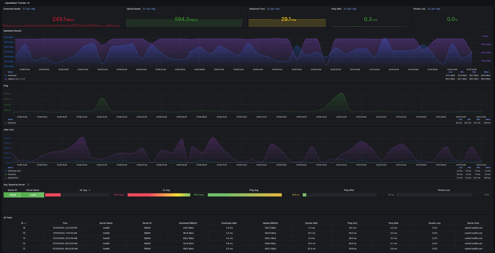

<!-- generated -->

# Speedtest Tracker

1-Click installation template for Speedtest Tracker on Easypanel

## Description

Speedtest Tracker is a self-hosted internet performance tracking application that runs speedtests and displays the results in a clean web interface. It automatically runs periodic speed tests using various providers like Ookla Speedtest, and stores historical data to track your internet connection performance over time. Perfect for monitoring ISP performance, network troubleshooting, and keeping records of internet speed changes.

## Benefits

- Internet Performance Monitoring: Automatically track your internet connection speed and performance over time with scheduled speed tests.
- Historical Data: Store and visualize historical speed test results to identify patterns and performance trends.
- Multiple Providers: Support for various speed test providers including Ookla Speedtest for accurate measurements.
- Self-Hosted Solution: Keep your network performance data private with a completely self-hosted monitoring solution.

## Features

- Automated Testing: Schedule automatic speed tests at regular intervals to continuously monitor your connection.
- Web Dashboard: Clean and intuitive web interface to view current and historical speed test results.
- Data Visualization: Charts and graphs to visualize speed trends and identify performance issues over time.
- SQLite Database: Lightweight SQLite database for storing test results without external database requirements.

## Links

- [Documentation](https://docs.speedtest-tracker.dev/)
- [GitHub](https://github.com/alexjustesen/speedtest-tracker)
- [Template Source](https://github.com/easypanel-io/templates/tree/main/templates/speedtest-tracker)

## Options

Name | Description | Required | Default Value
-|-|-|-
App Service Name | - | yes | speedtest-tracker
App Service Image | Speedtest Tracker Docker image | yes | lscr.io/linuxserver/speedtest-tracker:1.6.5

## Screenshots

## Change Log

- 2025-06-17 – Initial Template Release
- 2025-07-25 – Version bumped to 1.6.5

## Contributors

- [Ahson Shaikh](https://github.com/Ahson-Shaikh)
