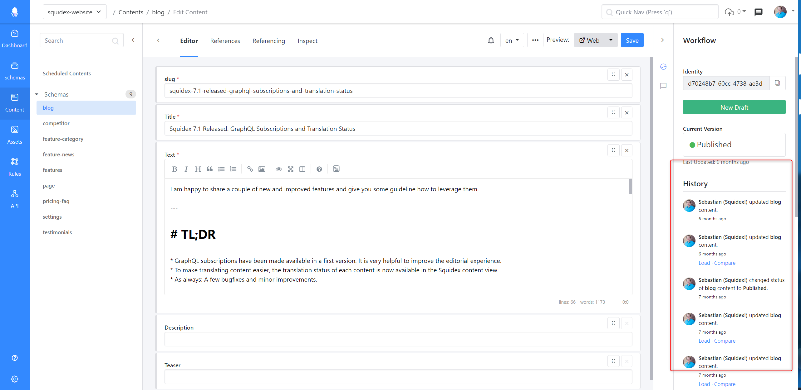

<!-- generated -->

# Squidex

1-Click installation template for Squidex on Easypanel

## Description

Squidex is an open-source, headless CMS designed for seamless content management across multiple platforms. It provides a real-time GraphQL API, fine-grained permissions, and a flexible workflow for content collaboration. Squidex supports event sourcing and integrates well with modern applications, ensuring a structured and efficient content distribution.

## Instructions

If you do not choose any identity provider, you can register a user when you go to the browser.

## Benefits

- Headless CMS: Squidex provides a robust headless content management system with a flexible API-first approach.
- Real-Time Collaboration: Enable teams to collaborate with real-time content updates and workflows.
- Multi-Platform Support: Deliver content seamlessly across web, mobile, and IoT devices.

## Features

- GraphQL & REST API: Easily fetch content using Squidex's powerful GraphQL or REST API.
- Version Control & History: Track content changes with built-in version control and rollback options.
- Permissions & Roles: Define granular user roles and permissions for secure content management.
- Event Sourcing: Benefit from a scalable event-driven architecture for data consistency.

## Links

- [Documentation](https://docs.squidex.io/)
- [Github](https://github.com/Squidex/squidex)
- [Template Source](https://github.com/easypanel-io/templates/tree/main/templates/squidex)

## Options

Name | Description | Required | Default Value
-|-|-|-
App Service Name | - | yes | squidex
App Service Image | - | yes | squidex/squidex:7
Admin Email Address | The email address for admin account. | no | 
Admin Password | The password for the admin account. | no | 
Google Client | The Client ID for Google OAuth authentication. | no | 
Google Client Secret | - | no | 
Github Client ID | The Client ID for Github OAuth authentication. | no | 
Github Client Secret | - | no | 
Microsoft Client ID | The Client ID for Microsoft OAuth authentication. | no | 
Microsoft Client Secret | - | no | 

## Screenshots

## Change Log

- 2025-01-29 – Template Release

## Contributors

- [Ahson Shaikh](https://github.com/Ahson-Shaikh)
