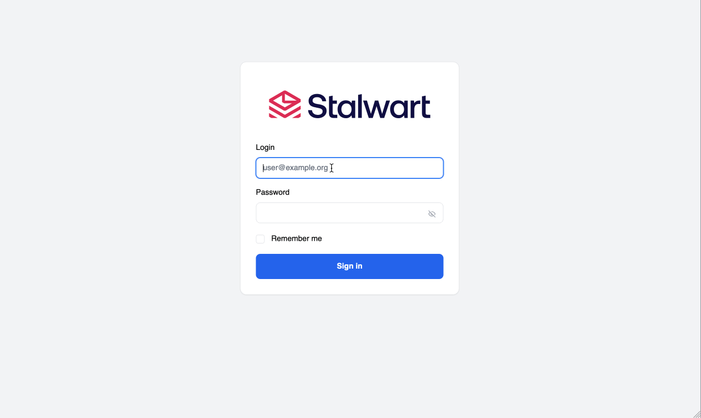
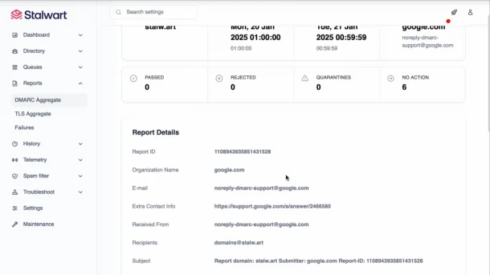
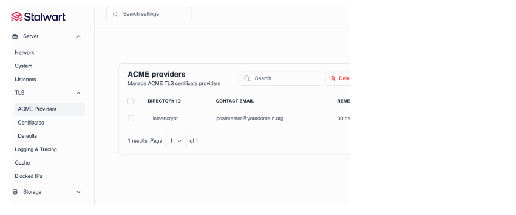

<!-- generated -->

# Stalwart

1-Click installation template for Stalwart on Easypanel

## Description

Stalwart is a modern, all-in-one mail and collaboration server written in Rust for security and performance. It bundles SMTP, IMAP, JMAP, POP3, CalDAV, CardDAV, and WebDAV into a single binary with a unified configuration. Features include a built-in spam and phishing filter with LLM-driven analysis, DMARC/DKIM/SPF/ARC authentication, encryption at rest with S/MIME or OpenPGP, automatic TLS via ACME, full-text search in 17 languages, Sieve scripting, and a web-based admin dashboard. It supports pluggable storage backends (RocksDB, FoundationDB, PostgreSQL, MySQL, SQLite, S3, Redis) and scales from a single instance to thousands of nodes with built-in clustering, load balancing, and fault tolerance.

## Instructions

On first boot, Stalwart auto-generates admin credentials and prints them to the container logs. Check the service logs to find the admin username and password. Then access the web admin at the service domain and log in. From there, configure your domain under Management &gt; Directory &gt; Domains, and Stalwart will generate the required DNS records (MX, DKIM, SPF, DMARC) for you. Set the correct server hostname in Settings &gt; Server &gt; Network. Mail ports (SMTP 25, submission 587/465, IMAP 143/993, POP3 110/995, ManageSieve 4190) are exposed for direct access.

## Benefits

- All-in-One Server: SMTP, IMAP, JMAP, POP3, CalDAV, CardDAV, WebDAV, spam filter, and web admin all in a single Rust binary. No need to stitch together multiple components.
- Written in Rust: Memory-safe by design with excellent performance. Security audited and built to handle everything from small personal setups to large-scale enterprise deployments.
- Built-in Spam & Phishing Filter: Comprehensive spam filtering with LLM-driven analysis, statistical classifier, DNS blocklists, greylisting, sender reputation, phishing protection, and collaborative filtering.
- Scales Seamlessly: From a single instance to thousands of nodes with peer-to-peer cluster coordination, load balancing, fault tolerance, and support for Kubernetes, Docker Swarm, and Apache Mesos.

## Features

- Complete Protocol Support: Full JMAP, IMAP4rev2, POP3, and SMTP support with DMARC, DKIM, SPF, ARC authentication and DANE, MTA-STS transport security.
- Calendars, Contacts & Files: Native CalDAV and CardDAV support for calendars and contacts, plus WebDAV for file storage and sharing with fine-grained access controls.
- Pluggable Storage Backends: Choose from RocksDB, FoundationDB, PostgreSQL, MySQL, SQLite, S3-compatible storage, Azure, or Redis. Full-text search via built-in engine, Meilisearch, or ElasticSearch.
- Encryption & Security: Encryption at rest with S/MIME or OpenPGP, automatic TLS via ACME, two-factor authentication, OAuth 2.0, OpenID Connect, LDAP, and fail2ban-style blocking.
- Web Admin Dashboard: Real-time monitoring, account and domain management, SMTP queue management, DMARC/TLS report visualization, log viewer, and self-service portal.
- Sieve Scripting: Full Sieve scripting language support with all registered extensions for powerful server-side email filtering and automation.

## Links

- [Website](https://stalw.art)
- [GitHub](https://github.com/stalwartlabs/stalwart)
- [Documentation](https://stalw.art/docs/install/get-started)
- [Template Source](https://github.com/easypanel-io/templates/tree/main/templates/stalwart)

## Options

Name | Description | Required | Default Value
-|-|-|-
App Service Name | - | yes | stalwart
Stalwart Image | - | yes | ghcr.io/stalwartlabs/stalwart:v0.15.5
SMTP Port | Inbound mail delivery (SMTP) | no | 25
SMTP Submission Port | Mail submission (SMTP with STARTTLS) | no | 587
SMTP Submission TLS Port | Mail submission over implicit TLS | no | 465
IMAP Port | IMAP with STARTTLS | no | 143
IMAPS Port | IMAP over implicit TLS | no | 993
POP3 Port | POP3 with STARTTLS | no | 110
POP3S Port | POP3 over implicit TLS | no | 995
ManageSieve Port | ManageSieve protocol for server-side mail filtering | no | 4190

## Screenshots

## Change Log

- 2026-02-20 – Template Release

## Contributors

- [Ahson Shaikh](https://github.com/Ahson-Shaikh)
