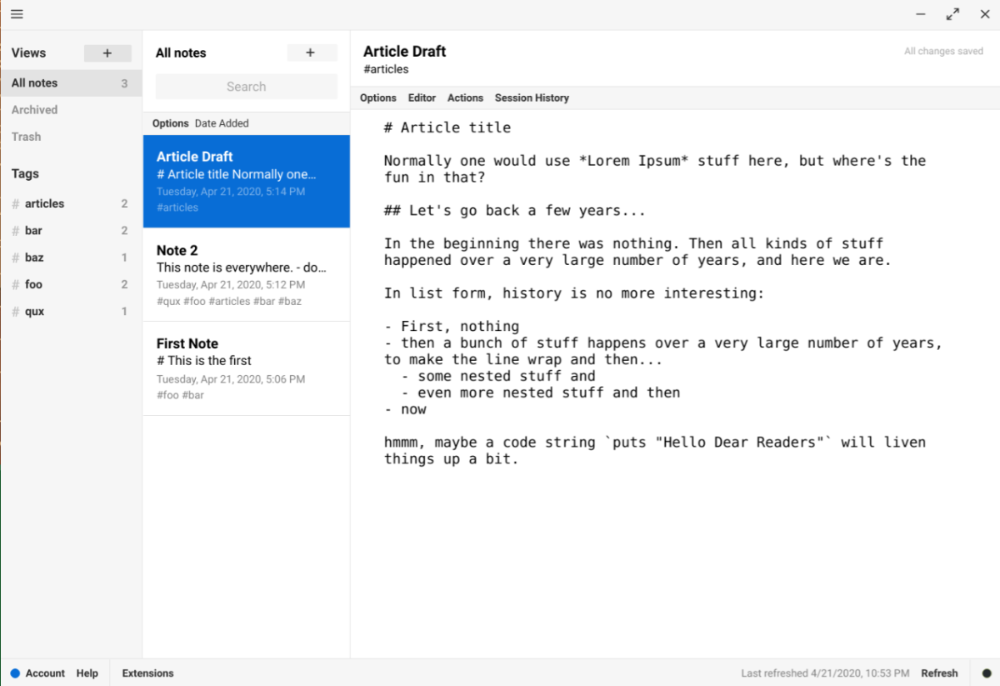

<!-- generated -->

# StandardNotes

1-Click installation template for StandardNotes on Easypanel

## Description

StandardNotes is a private, end-to-end encrypted notes app that provides a secure platform for writing and organizing your thoughts. It offers a clean, distraction-free interface with strong encryption to protect your privacy. The self-hosted version gives you complete control over your data while maintaining all the security features of the cloud version.

## Benefits

- End-to-End Encryption: Your notes are encrypted on your device before being sent to the server, ensuring complete privacy and security of your personal data.
- Self-Hosted Privacy: Complete control over your data with self-hosted deployment, ensuring your notes never leave your own infrastructure.
- Clean, Distraction-Free Interface: Minimalist design focused on writing without distractions, helping you concentrate on your thoughts and ideas.

## Features

- Secure Note Taking: Write and organize notes with strong encryption protecting your content from unauthorized access or data breaches.
- Multi-Platform Access: Access your notes from any device with web browsers, mobile apps, and desktop applications for seamless note-taking across platforms.
- File Attachments: Attach files to your notes with the same encryption protection, keeping all your documents secure and organized.
- Tagging and Organization: Organize your notes with tags, folders, and search functionality to quickly find and manage your content.
- Version History: Track changes to your notes over time with automatic version history and the ability to restore previous versions.
- Offline Access: Work on your notes even when offline, with automatic synchronization when you reconnect to the internet.

## Links

- [Documentation](https://docs.standardnotes.com/self-hosting/getting-started)
- [Github](https://github.com/standardnotes/app)
- [Template Source](https://github.com/easypanel-io/templates/tree/main/templates/standardnotes)

## Options

Name | Description | Required | Default Value
-|-|-|-
App Service Name | - | yes | standardnotes
Web Service Image | - | yes | standardnotes/web:9b023782830a4742b31cd3696cc2f8fff22e0936

## Screenshots

## Change Log

- 2025-09-16 – Template Release (9b023782830a4742b31cd3696cc2f8fff22e0936)

## Contributors

- [Ahson Shaikh](https://github.com/Ahson-Shaikh)
