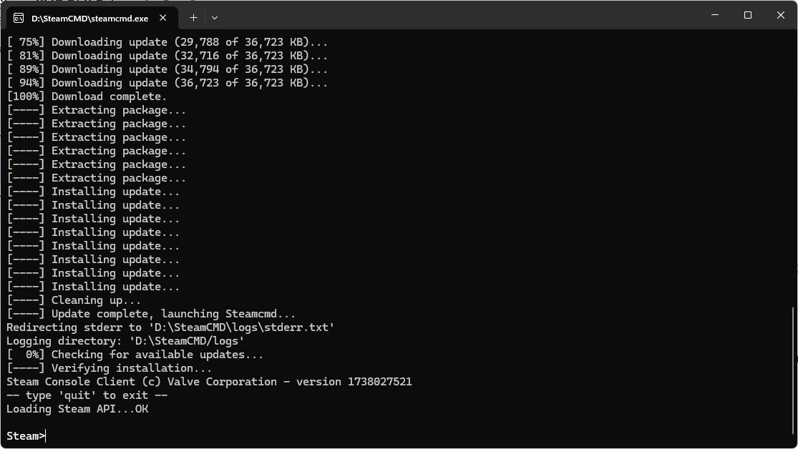

<!-- generated -->

# SteamCMD

1-Click installation template for SteamCMD on Easypanel

## Description

SteamCMD is a command-line version of the Steam client for installing and updating Steam games and dedicated servers. It&#39;s perfect for managing game servers and game installations.

## Instructions

After installation, you can use SteamCMD to install and update games. The installation directory can be configured in the settings.

## Benefits

- Game Management: Install and update Steam games and dedicated servers
- Command Line: Powerful command-line interface for automation
- Official Tool: Official Valve tool for game server management
- Containerized: Runs in a container for easy management

## Features

- Game Installation: Install any Steam game or dedicated server
- Automatic Updates: Keep games and servers up to date
- Custom Commands: Run any SteamCMD command
- Volume Persistence: Persistent game data through volume mounting
- Automation: Perfect for automated game server management

## Links

- [Documentation](https://developer.valvesoftware.com/wiki/SteamCMD)
- [Docker Hub](https://hub.docker.com/r/steamcmd/steamcmd)
- [Template Source](https://github.com/easypanel-io/templates/tree/main/templates/steamcmd)

## Options

Name | Description | Required | Default Value
-|-|-|-
App Service Name | - | yes | steamcmd
App Service Image | - | yes | steamcmd/steamcmd:latest
Installation Path | Host path where games will be installed | yes | /path/to/games
Steam Command | SteamCMD command to install CSGO locally to data directory. | yes | +login anonymous +force_install_dir /data +app_update 740 +quit

## Screenshots

## Change Log

- 2025-05-05 – Initial release

## Contributors

- [Ahson Shaikh](https://github.com/Ahson-Shaikh)
