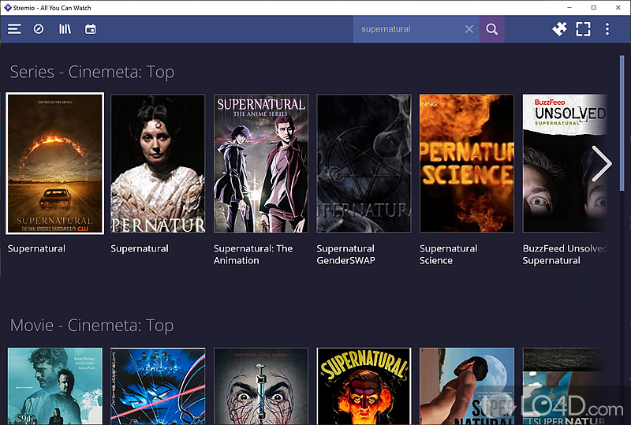

<!-- generated -->

# Stremio

1-Click installation template for Stremio on Easypanel

## Description

Stremio is a modern media center application that provides a unified platform for streaming movies, TV shows, and live TV content. This template uses the community Docker image tsaridas/stremio-docker (server and web UI). The self-hosted setup lets you run your own Stremio server, giving you complete control over your media streaming experience. With support for various content sources and add-ons, Stremio aggregates content from multiple providers into a single interface. The application features automatic server URL configuration and CORS handling, making it easy to access from any device. With persistent storage for server data and configurations, Stremio ensures your settings and preferences are retained across container restarts. Perfect for media enthusiasts who want a centralized streaming solution, users looking for a self-hosted alternative to commercial streaming services, or anyone seeking a flexible media center that can aggregate content from multiple sources.

## Benefits

- Unified Media Center: Aggregate and stream movies, TV shows, and live TV content from multiple sources in a single, unified interface.
- Self-Hosted Control: Complete control over your media streaming experience with a self-hosted solution that keeps your data private.
- Persistent Storage: Server data and configurations are stored persistently ensuring your settings and preferences are retained across container restarts.
- Easy Access: Automatic server URL configuration and CORS handling make it easy to access your Stremio server from any device.

## Features

- Media Streaming: Stream movies, TV shows, and live TV content from various sources through a single interface.
- Add-on Support: Extend functionality with add-ons that provide access to additional content sources and features.
- Automatic Configuration: Automatic server URL configuration and CORS handling for seamless access from any device.
- Web Interface: Access your Stremio server through a web interface that works on any device with a browser.

## Links

- [GitHub](https://github.com/tsaridas/stremio-docker)
- [Docker Hub](https://hub.docker.com/r/tsaridas/stremio-docker)
- [Website](https://www.stremio.com)
- [Blog](https://blog.stremio.com)
- [Template Source](https://github.com/easypanel-io/templates/tree/main/templates/stremio)

## Options

Name | Description | Required | Default Value
-|-|-|-
App Service Name | - | yes | stremio
App Service Image | - | yes | tsaridas/stremio-docker:v1.2.12

## Screenshots

## Change Log

- 2026-01-05 – Template Release

## Contributors

- [Ahson Shaikh](https://github.com/Ahson-Shaikh)
