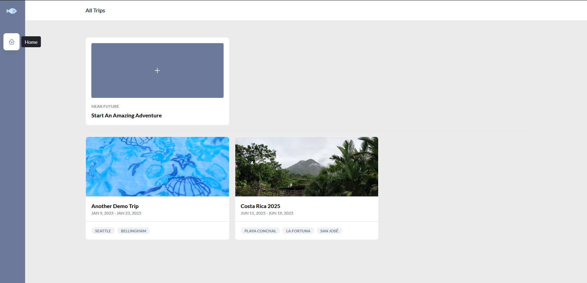

<!-- generated -->

# Surmai

1-Click installation template for Surmai on Easypanel

## Description

Surmai is a personal and family travel organizer—a Progressive Web App for collaborative trip planning with privacy-first, self-hosted data. Built on PocketBase, it helps you keep itineraries, bookings, documents, and trip details in one place, with multi-user collaboration and offline-friendly access. The stack exposes the web UI on port 8080 and persists PocketBase data under /pb_data.

## Instructions

After deploy, sign in with the admin email you configured and the password
shown in the service environment (SURMAI_ADMIN_PASSWORD)—it is auto-generated
for a strong default. Change it after first login if you like. See
https://surmai.app/documentation/installation for Docker details.

## Benefits

- Trip planning in one place: Organize itineraries, bookings, and trip artifacts collaboratively instead of scattered inboxes and notes.
- Privacy: Self-hosted PocketBase backend—your travel data stays on your server.
- Collaborative: Multiple people can plan together while keeping access under your control.
- PWA & mobile-friendly: Installable as a Progressive Web App for easier access on phones during travel.

## Features

- PocketBase backend: PocketBase powers the API; data lives in /pb_data with a volume for persistence.
- Travel-focused workflow: Built for real trip planning (alpha-stage; project under active development).
- Admin bootstrap: SURMAI_ADMIN_EMAIL and a strong auto-generated SURMAI_ADMIN_PASSWORD on first deploy.
- Docker deployment: Official image from ghcr.io/rohitkumbhar/surmai with documented installation.

## Links

- [Website](https://surmai.app/)
- [Documentation](https://surmai.app/documentation/)
- [GitHub](https://github.com/rohitkumbhar/surmai)
- [Template Source](https://github.com/easypanel-io/templates/tree/main/templates/surmai)

## Options

Name | Description | Required | Default Value
-|-|-|-
App Service Name | - | yes | surmai
App Service Image | - | yes | ghcr.io/rohitkumbhar/surmai:v0.4.16
Admin Email | Initial Surmai administrator email (PocketBase admin) | yes | admin@example.com

## Screenshots

## Change Log

- 2026-03-23 – Accurate travel-organizer description; image v0.4.16; auto-generated admin password (randomPassword).
- 2025-01-21 – Initial Template Release

## Contributors

- [Ahson Shaikh](https://github.com/Ahson-Shaikh)
