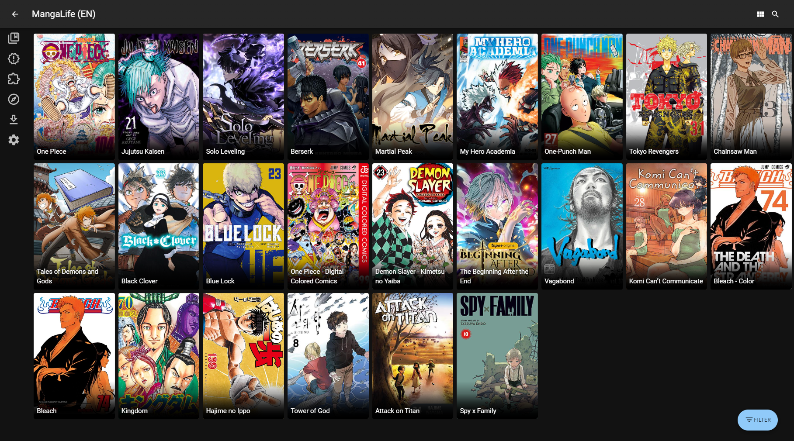

<!-- generated -->

# Suwayomi Server

1-Click installation template for Suwayomi Server on Easypanel

## Description

Suwayomi Server is a free and open source manga reader server that runs on the desktop and mobile. It provides a web interface for reading manga from various sources and supports multiple extensions. Suwayomi Server allows you to organize your manga library, track reading progress, and access your collection from any device through a modern web interface.

## Benefits

- Free and Open Source: Suwayomi Server is completely free and open source, giving you full control over your manga reading experience without any subscription fees.
- Multi-Source Support: Access manga from various sources through a unified interface with support for multiple extensions and catalogs.
- Cross-Platform Access: Read your manga collection from any device with a web browser, including desktop computers, tablets, and smartphones.

## Features

- Web-Based Reader: Modern web interface for reading manga with features like zoom, page navigation, and reading progress tracking.
- Library Management: Organize your manga collection with categories, favorites, and custom reading lists for easy browsing and management.
- Extension Support: Extend functionality with various extensions to access different manga sources and catalogs from around the web.
- Reading Progress Tracking: Track your reading progress across different manga series and resume reading from where you left off on any device.
- Download Management: Download manga chapters for offline reading with automatic organization and storage management.
- User Management: Support for multiple users with individual reading progress and personalized library organization.

## Links

- [Documentation](https://suwayomi.org/)
- [Github](https://github.com/Suwayomi/Suwayomi-Server)
- [Template Source](https://github.com/easypanel-io/templates/tree/main/templates/suwayomi-server)

## Options

Name | Description | Required | Default Value
-|-|-|-
App Service Name | - | yes | suwayomi-server
App Service Image | - | yes | ghcr.io/suwayomi/suwayomi-server:v2.1.2031

## Screenshots

## Change Log

- 2025-09-12 – Template Release
- 2025-12-29 – Version bumped to v2.1.2031

## Contributors

- [Ahson Shaikh](https://github.com/Ahson-Shaikh)
