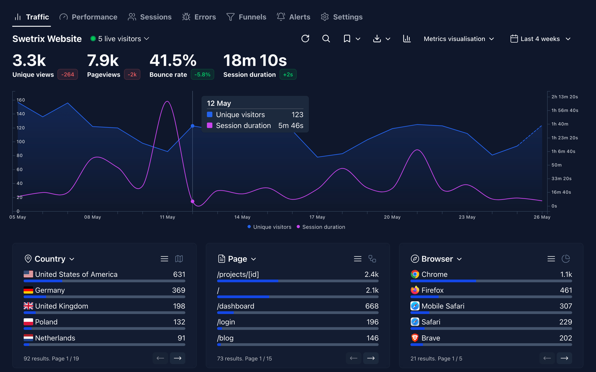

<!-- generated -->

# Swetrix

1-Click installation template for Swetrix on Easypanel

## Description

Swetrix is a powerful, privacy-focused analytics platform that provides comprehensive website and application analytics. Built with modern technologies, it offers real-time data collection, beautiful dashboards, and detailed insights into user behavior. Features include event tracking, performance monitoring, user session analysis, and customizable reports. Self-hosted solution that ensures complete data privacy and control while providing enterprise-grade analytics capabilities.

## Benefits

- Privacy-Focused: Complete control over your analytics data with self-hosting.
- Real-time Analytics: Monitor website and application performance in real-time.
- Modern Interface: Beautiful, intuitive dashboard for visualizing analytics data.
- High Performance: Built with ClickHouse for fast query processing and Redis for caching.

## Features

- Website Analytics: Comprehensive tracking of page views, user sessions, and interactions.
- Event Tracking: Custom event tracking for detailed user behavior analysis.
- Performance Monitoring: Monitor page load times and application performance metrics.
- Real-time Dashboard: Live analytics dashboard with customizable charts and reports.
- API Access: RESTful API for programmatic access to analytics data.

## Links

- [GitHub](https://github.com/Swetrix/swetrix)
- [Website](https://swetrix.com)
- [Documentation](https://docs.swetrix.com)
- [Template Source](https://github.com/easypanel-io/templates/tree/main/templates/swetrix)

## Options

Name | Description | Required | Default Value
-|-|-|-
Service Name | - | yes | swetrix
Frontend Image | - | yes | swetrix/swetrix-fe:v3.3.1
API Image | - | yes | swetrix/swetrix-api:v3.3.1
ClickHouse Image | - | yes | clickhouse/clickhouse-server:24.10-alpine
Admin Email | Email address for the default admin user | yes | admin@example.com
Admin Password | Password for the default admin user | yes | admin1234567

## Screenshots

## Change Log

- 2025-06-03 – First release (v3.3.1)

## Contributors

- [Ahson Shaikh](https://github.com/Ahson-Shaikh)
