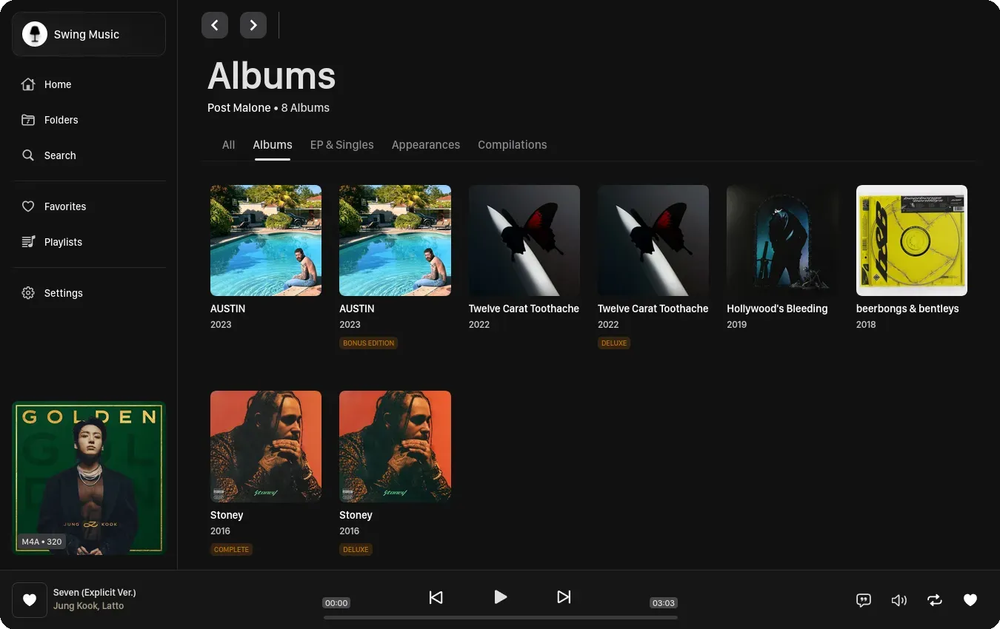

<!-- generated -->

# Swingmusic

1-Click installation template for Swingmusic on Easypanel

## Description

Swingmusic is a beautiful, self-hosted music player and streaming server for your personal music collection. It provides a modern, intuitive web interface that allows you to stream your music library from anywhere. With support for various audio formats and a clean, responsive design, Swingmusic makes it easy to enjoy your music collection across all your devices. The application offers features like playlist management, search functionality, and album artwork display, making it a perfect alternative to commercial streaming services for those who want to keep their music library private and under their control.

## Instructions

Default credentials are admin/admin

## Benefits

- Self-Hosted Music Streaming: Host your own music streaming server to access your personal music collection from anywhere without relying on commercial streaming services or subscriptions.
- Privacy & Control: Keep your music library completely private on your own infrastructure with full control over your data and listening habits without third-party tracking.
- Modern Web Interface: Enjoy a beautiful, responsive web interface that works seamlessly across desktop, tablet, and mobile devices for a consistent listening experience.
- Format Support: Play your music collection regardless of format with broad audio file support, eliminating the need to convert your existing library.

## Features

- Music Library Management: Organize and browse your entire music collection with support for artists, albums, tracks, and automatic metadata extraction from audio files.
- Playlist Creation: Create and manage custom playlists to organize your favorite tracks and enjoy curated listening experiences tailored to your preferences.
- Search & Discovery: Quickly find any song, album, or artist in your collection with powerful search functionality and intuitive browsing capabilities.
- Album Artwork Display: Automatically display embedded album artwork from your audio files for a visually rich music browsing and playback experience.
- Web-Based Player: Stream your music through any modern web browser without requiring additional software or plugins on your devices.
- Responsive Design: Access your music library from any device with a fully responsive interface that adapts to different screen sizes and orientations.

## Links

- [GitHub](https://github.com/swingmx/swingmusic)
- [Documentation](https://github.com/swingmx/swingmusic#readme)
- [Demo](https://swingmx.com)
- [Template Source](https://github.com/easypanel-io/templates/tree/main/templates/swingmusic)

## Options

Name | Description | Required | Default Value
-|-|-|-
App Service Name | - | yes | swingmusic
App Service Image | Swingmusic Docker image from GitHub Container Registry | yes | ghcr.io/swingmx/swingmusic:v2.0.9

## Screenshots

## Change Log

- 2025-10-22 – Initial Template Release

## Contributors

- [Ahson Shaikh](https://github.com/Ahson-Shaikh)
