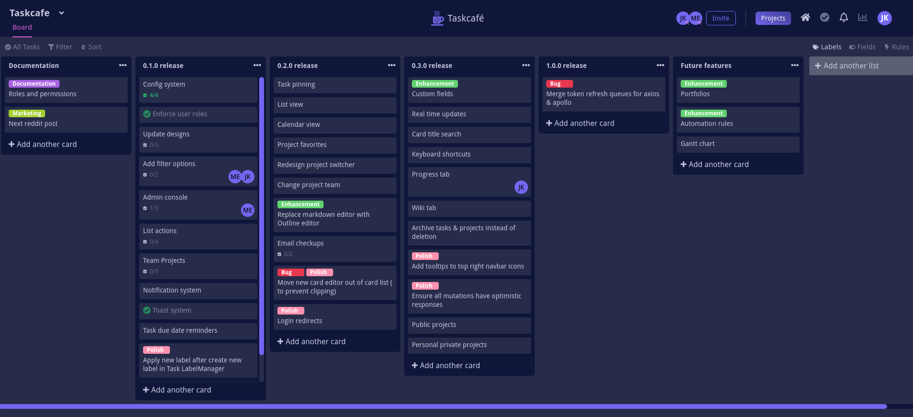

<!-- generated -->

# TaskCafe

1-Click installation template for TaskCafe on Easypanel

## Description

TaskCafe is a modern, open-source project management tool that helps teams organize and track their work. It provides an intuitive interface for managing projects, tasks, and collaborations with features similar to Trello and other project management tools.

## Instructions

After installation, access the web interface through the provided domain to start managing your projects and tasks.

## Benefits

- Project Management: Organize and track projects with an intuitive interface.
- Task Organization: Create, manage, and track tasks efficiently.
- Team Collaboration: Work together with team members on projects and tasks.
- File Uploads: Upload and attach files to tasks and projects.
- Database Persistence: Reliable PostgreSQL database for data storage.

## Features

- Project Boards: Visual boards for organizing and tracking tasks.
- Task Management: Create, assign, and track tasks with detailed information.
- File Attachments: Upload and manage files related to tasks.
- User Management: Manage team members and their access.
- Modern Interface: Clean and intuitive web interface for project management.

## Links

- [Github](https://github.com/JordanKnott/taskcafe)
- [Documentation](https://github.com/JordanKnott/taskcafe/wiki)
- [Template Source](https://github.com/easypanel-io/templates/tree/main/templates/taskcafe)

## Options

Name | Description | Required | Default Value
-|-|-|-
App Service Name | - | yes | taskcafe
App Service Image | - | yes | taskcafe/taskcafe:0.3.6

## Screenshots

## Change Log

- 2025-04-10 – First Release
- 2026-05-07 – Version bumped to 0.3.6

## Contributors

- [Ahson Shaikh](https://github.com/Ahson-Shaikh)
