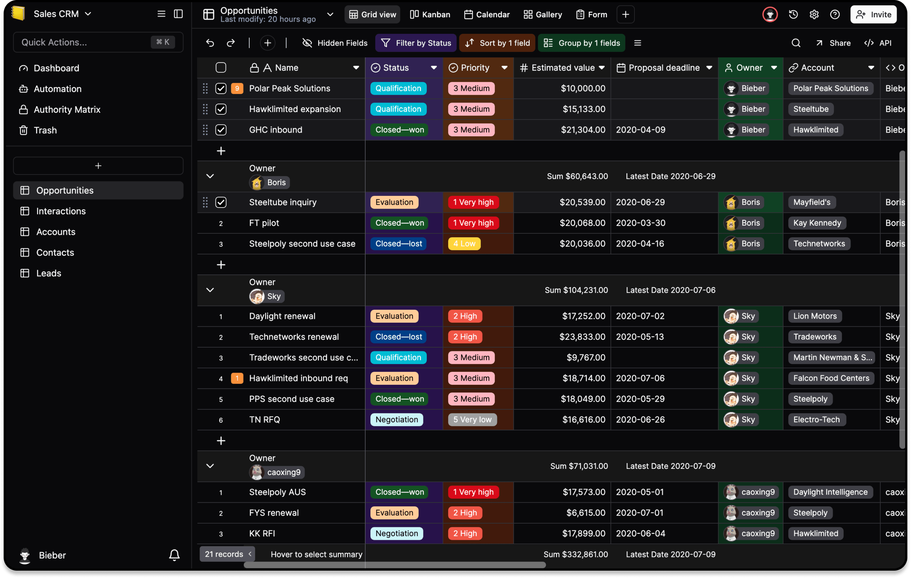

<!-- generated -->

# Teable

1-Click installation template for Teable on Easypanel

## Description

Teable is a powerful, self-hosted service designed for managing team collaboration and projects efficiently. It offers a clean and user-friendly interface, supports plugins for extended functionality, and provides detailed analytics on team activities. With Teable, you can maintain full control over your data and workflows.

## Instructions

Wait for the migration to complete, then start using Teable for managing your projects.

## Benefits

- Efficient Collaboration: Teable simplifies team collaboration and project management through a unified platform.
- Self-Hosted Solution: Stay in control of your data with a self-hosted service, ensuring privacy and flexibility.
- Customizable Workflows: Customize workflows to match your team’s unique processes and enhance productivity.

## Features

- API Access: Integrate Teable with other tools using its flexible API for programmatic access.
- Plugin Support: Extend Teable’s functionality with various plugins to meet specific team needs.
- Activity Analytics: Gain insights into project progress, team activities, and overall performance.
- Task Management: Organize tasks, set priorities, and track progress in one place for effective project management.

## Links

- [Documentation](https://teable.io/docs)
- [Github](https://github.com/teableio/teable)
- [Template Source](https://github.com/easypanel-io/templates/tree/main/templates/teable)

## Options

Name | Description | Required | Default Value
-|-|-|-
App Service Name | - | yes | teable
App Service Image | - | yes | ghcr.io/teableio/teable:753fb6ad997f70693688bce057f0c8cf5da8e6ee
Migration Service Image | - | yes | ghcr.io/teableio/teable-db-migrate:753fb6ad997f70693688bce057f0c8cf5da8e6ee
Enable Arm | - | no | false

## Screenshots

## Change Log

- 2025-02-12 – Initial Template Release
- 2025-07-25 – Version bumped to 753fb6ad997f70693688bce057f0c8cf5da8e6ee

## Contributors

- [Ahson Shaikh](https://github.com/Ahson-Shaikh)
