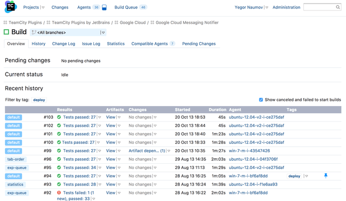

<!-- generated -->

# TeamCity

1-Click installation template for TeamCity on Easypanel

## Description

TeamCity is a build management and continuous integration server from JetBrains.

## Instructions

After setup, connect your Git repository and create a Build Configuration. If you enabled the bundled agent, it will auto-register to the server; approve it in **Agents** before running your first build.

## Benefits

- Powerful CI/CD: TeamCity provides a robust platform for continuous integration and deployment with support for various build tools and version control systems.
- User-Friendly Interface: Intuitive web interface makes it easy to configure and monitor your builds and deployments.
- Scalable Architecture: Built to scale with support for multiple build agents and distributed builds.

## Features

- Build Management: Comprehensive build management with support for various build tools and frameworks.
- Version Control Integration: Seamless integration with popular version control systems like Git, SVN, and Mercurial.
- Build Agents: Support for multiple build agents to distribute and parallelize builds.
- Build History: Detailed build history and statistics for better project insights.
- Customizable Workflows: Flexible build configurations and customizable build workflows.
- Containerized: Easy to deploy and manage in containerized environments.

## Links

- [Github](https://github.com/JetBrains/teamcity-docker-images)
- [Documentation](https://www.jetbrains.com/help/teamcity/teamcity-docker.html)
- [Template Source](https://github.com/easypanel-io/templates/tree/main/templates/teamcity)

## Options

Name | Description | Required | Default Value
-|-|-|-
App Service Name | - | yes | teamcity
App Service Image | - | yes | jetbrains/teamcity-server:2025.11.4
Agent Service Image | - | yes | jetbrains/teamcity-agent:2025.11.4
Enable TeamCity Agent | Set to true to deploy a TeamCity agent alongside the server | yes | false

## Screenshots

## Change Log

- 2025-04-29 – First Release
- 2026-05-07 – Version bumped to 2025.11.4

## Contributors

- [Ahson Shaikh](https://github.com/Ahson-Shaikh)
