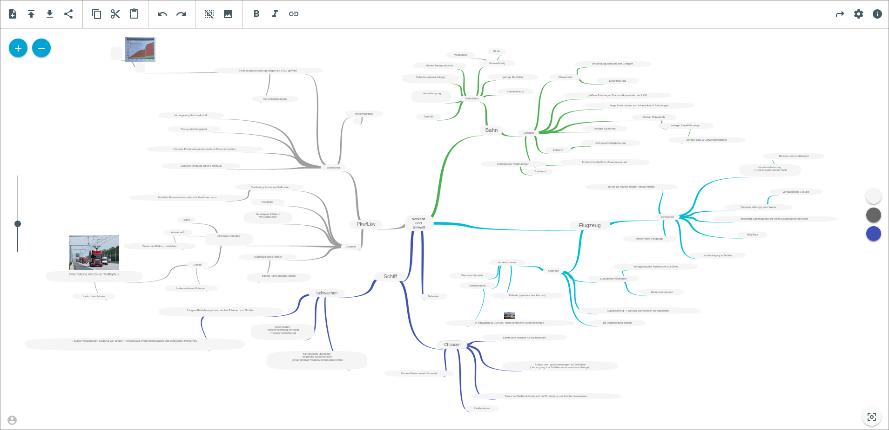

<!-- generated -->

# TeamMapper

1-Click installation template for TeamMapper on Easypanel

## Description

TeamMapper is a powerful team mapping and visualization tool designed to help organizations understand team structures, relationships, and collaboration patterns. It provides an intuitive interface for creating interactive team maps that visualize team members, their roles, departments, and connections. TeamMapper enables teams to better understand their organizational structure, identify collaboration opportunities, and optimize team dynamics. The platform supports real-time updates, customizable visualizations, and comprehensive team analytics to help organizations make data-driven decisions about team composition and workflow optimization.

## Instructions

Deploy the stack and open your assigned domain to complete TeamMapper setup. The application connects automatically to the internal PostgreSQL service created by this template. On first startup, create your initial account in the web interface and then configure your organization and team structure. Data is persisted in /app/data and in PostgreSQL volumes, so updates and restarts keep existing content. DELETE_AFTER_DAYS is set to 30 by default in this template. Change it after deploy if your retention requirements differ.

## Benefits

- Team Structure Visualization: Create clear, interactive visualizations of your team structure that help everyone understand roles, responsibilities, and reporting relationships at a glance.
- Collaboration Insights: Identify collaboration patterns and opportunities within your organization to optimize team dynamics and improve cross-functional communication.
- Organizational Clarity: Provide transparency into team composition and structure, helping new team members understand the organization and existing members stay aligned.
- Data-Driven Team Decisions: Use comprehensive team analytics and insights to make informed decisions about team composition, resource allocation, and workflow optimization.

## Features

- Interactive Team Maps: Create dynamic, interactive team maps with drag-and-drop functionality, customizable layouts, and real-time updates to reflect organizational changes.
- Role and Department Mapping: Map team members to their roles, departments, and reporting structures with visual indicators and customizable categorization options.
- Real-Time Updates: Keep team maps current with real-time updates that automatically reflect organizational changes, new hires, role changes, and department restructuring.
- Customizable Visualizations: Customize the appearance of team maps with different layouts, color schemes, and visual elements to match your organization's branding and preferences.
- Team Analytics: Access comprehensive analytics about team composition, collaboration patterns, and organizational metrics to support data-driven decision making.
- Export and Sharing: Export team maps in various formats and share them with stakeholders, making it easy to communicate organizational structure across teams.
- Secure Data Management: Built-in data retention policies and secure database storage ensure sensitive organizational information is protected and managed according to your policies.
- Multi-User Support: Support for multiple users with role-based access control, allowing different team members to view and edit team maps based on their permissions.

## Links

- [Website](https://teammapper.io)
- [GitHub](https://github.com/b310-digital/teammapper)
- [Container registry](https://github.com/b310-digital/teammapper/pkgs/container/teammapper)
- [Template Source](https://github.com/easypanel-io/templates/tree/main/templates/teammapper)

## Options

Name | Description | Required | Default Value
-|-|-|-
App Service Name | - | yes | teammapper
App Service Image | - | yes | ghcr.io/b310-digital/teammapper:v0.2.6-1

## Screenshots

## Change Log

- 2025-10-07 – First Release
- 2026-03-26 – Added setup instructions and corrected registry link label
- 2026-05-07 – Version bumped to v0.2.6-1

## Contributors

- [Ahson Shaikh](https://github.com/Ahson-Shaikh)
