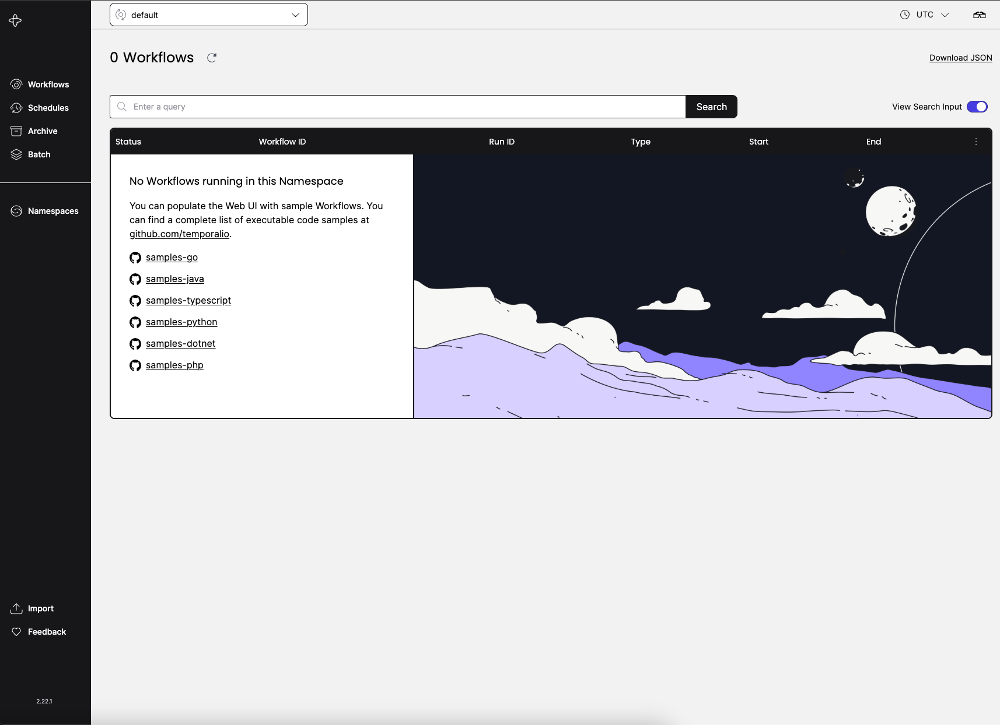

<!-- generated -->

# Temporal

1-Click installation template for Temporal on Easypanel

## Description

Temporal is an open-source, self-hosted workflow orchestration engine designed to simplify and enhance the development of scalable, fault-tolerant, and long-running workflows. It empowers developers to build reliable distributed systems by providing built-in state management, automatic retries, and advanced task scheduling. Temporal offers a user-friendly developer experience, powerful SDKs, and seamless integration with various languages, making it ideal for automating complex business processes and microservice orchestration. By providing a self-hosted solution, Temporal ensures data privacy, high availability, and complete control over your workflows and infrastructure.

## Benefits

- Streamlined Workflow Orchestration: Temporal simplifies building and managing distributed workflows, providing an intuitive way to orchestrate complex business processes and long-running tasks.
- Self-Hosted Flexibility: Maintain full control over your workflows and data with a self-hosted setup that ensures privacy, compliance, and high availability.
- Fault-Tolerant and Scalable: Temporal offers built-in fault tolerance, automatic retries, and scalable task execution, ensuring reliability even in highly distributed environments.

## Features

- Powerful SDK Support: Seamlessly integrate Temporal into your applications with robust SDKs for Go, Java, TypeScript, and Python, allowing easy development and deployment of workflows.
- Workflow State Persistence: Automatically persist workflow state and execution history to resume operations from the exact point of failure or interruption.
- Advanced Task Scheduling: Schedule and manage tasks with fine-grained control, enabling time-based or event-driven workflows with ease.
- Built-In Observability: Gain real-time insights into workflow performance, task execution, and bottlenecks with Temporal’s built-in observability tools.

## Links

- [Documentation](https://docs.temporal.io/)
- [Github](https://github.com/temporalio/temporal)
- [Template Source](https://github.com/easypanel-io/templates/tree/main/templates/temporal)

## Options

Name | Description | Required | Default Value
-|-|-|-
App Service Name | - | yes | temporal
App Service Image | - | yes | temporalio/auto-setup:1.26.2
Elasticsearch Service Image | - | yes | elasticsearch:7.16.2
Temporal UI Service Image | - | yes | temporalio/ui:2.22.1
Temporal Admin Service Image | - | yes | temporalio/admin-tools:1.26.2

## Screenshots

## Change Log

- 2025-01-03 – Template Release

## Contributors

- [Ahson Shaikh](https://github.com/Ahson-Shaikh)
