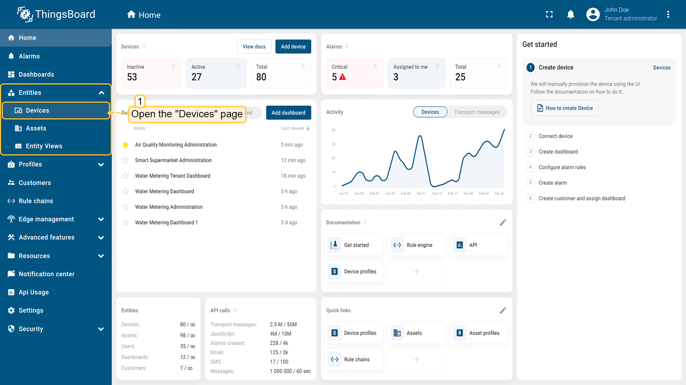

<!-- generated -->

# Thingsboard

1-Click installation template for Thingsboard on Easypanel

## Description

ThingsBoard is an open-source IoT platform designed to simplify the process of collecting, processing, and visualizing data from IoT devices. It provides features like real-time device management, telemetry data visualization, and rule engine workflows to automate tasks and actions.

## Instructions

Copy the email and passwords. sysadmin@thingsboard.org / sysadmin, tenant@thingsboard.org / tenant, customer@thingsboard.org / customer. Expose the ports mentioned inside the documentation based on your requirements.

## Benefits

- Real-Time Device Management: ThingsBoard provides an intuitive interface for managing devices and monitoring their status in real time.
- Data Visualization: Visualize telemetry data through customizable dashboards, charts, and widgets for actionable insights.
- Protocol Support: ThingsBoard supports multiple protocols like MQTT, HTTP, and CoAP, ensuring compatibility with various IoT devices.
- Rule Engine Automation: Automate workflows and actions using ThingsBoard's powerful rule engine, reducing manual intervention.
- Multi-Tenancy Support: Manage multiple tenants, customers, and devices from a single platform with granular access control.

## Features

- Telemetry Data Collection: Collect telemetry data from connected IoT devices and store it for analysis and visualization.
- Custom Dashboards: Build dynamic dashboards to visualize data and monitor device performance in real time.
- Device Management: Manage devices and assets with features like provisioning, monitoring, and control.
- Integration with Third-Party Services: Integrate ThingsBoard with external services to extend functionality and enable seamless IoT solutions.
- Alerts and Notifications: Set up alerts and notifications for specific events or conditions to stay informed about critical activities.

## Links

- [Documentation](https://thingsboard.io/docs/)
- [Docker Guide](https://thingsboard.io/docs/user-guide/install/docker/)
- [Github](https://github.com/thingsboard/thingsboard)
- [Template Source](https://github.com/easypanel-io/templates/tree/main/templates/thingsboard)

## Options

Name | Description | Required | Default Value
-|-|-|-
App Service Name | - | yes | thingsboard
App Service Image | - | yes | thingsboard/tb-postgres:3.8.1

## Screenshots

## Change Log

- 2025-01-21 – Template Release

## Contributors

- [Ahson Shaikh](https://github.com/Ahson-Shaikh)
