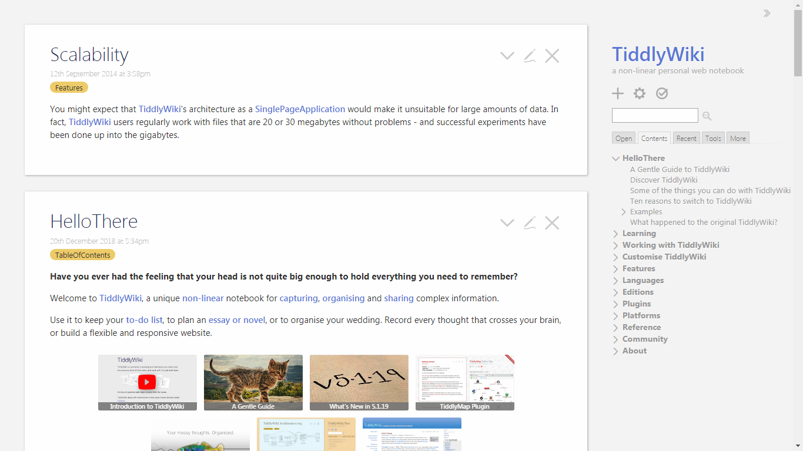

<!-- generated -->

# Tiddlywiki

1-Click installation template for Tiddlywiki on Easypanel

## Description

Tiddlywiki is a unique open-source, single-file wiki designed to help you organize, capture, and share information effectively. It is a versatile personal notebook that allows you to create, organize, and navigate your notes in a self-contained HTML file. Tiddlywiki is highly customizable, enabling users to tweak layouts, styles, and functionality through plugins and scripts. It works offline and can be hosted online for collaboration or personal use. Whether you&#39;re creating a personal knowledge base, journaling, or managing projects, Tiddlywiki provides a flexible platform to meet your needs.

## Benefits

- Portable and Self-Contained: Tiddlywiki is a single-file wiki that can be easily carried around, shared, or hosted online, offering unmatched portability and simplicity.
- Works Offline: Tiddlywiki operates entirely offline, making it perfect for personal use, note-taking, and managing data without needing an internet connection.
- Customizable: With plugins, themes, and custom scripting options, you can fully tailor Tiddlywiki to your specific needs and preferences.
- Flexible Use Cases: Tiddlywiki supports a wide range of applications, from personal knowledge management to project tracking, journaling, and task organization.
- Free and Open Source: Tiddlywiki is free to use and open source, encouraging contributions and community-driven development.

## Features

- Single-File Wiki: A self-contained HTML file that includes your data, layout, and functionality in one place.
- Fully Customizable: Customize your Tiddlywiki using plugins, themes, and JavaScript to create the perfect tool for your needs.
- Works Offline: Save your Tiddlywiki locally and use it without an internet connection.
- Open Source Community: Leverage a rich ecosystem of plugins and themes developed by the community.
- Easy Sharing: Share your Tiddlywiki as a single HTML file or host it online for others to access.

## Links

- [Website](https://tiddlywiki.com)
- [Docs](https://tiddlywiki.com/#Documentation)
- [Github](https://github.com/Jermolene/TiddlyWiki5)
- [Template Source](https://github.com/easypanel-io/templates/tree/main/templates/tiddlywiki)

## Options

Name | Description | Required | Default Value
-|-|-|-
App Service Name | - | yes | tiddlywiki
App Service Image | - | yes | nicolaw/tiddlywiki:5.3.6

## Screenshots

## Change Log

- 2025-01-21 – First Release

## Contributors

- [Ahson-Shaikh](https://github.com/Ahson-Shaikh)
