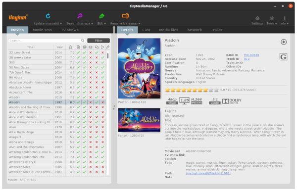

<!-- generated -->

# TinyMediaManager

1-Click installation template for TinyMediaManager on Easypanel

## Description

TinyMediaManager is a media management tool designed to organize and manage your movie and TV show collections. It automatically fetches metadata from various sources, downloads artwork, and helps keep your media library well-organized with proper naming conventions and metadata files for media servers like Plex, Emby, and Jellyfin.

## Benefits

- Automated Metadata Retrieval: Automatically fetch movie and TV show metadata from online sources like TMDB, TVDB, and IMDB
- Artwork Management: Download and manage posters, fanart, banners, and other artwork for your media
- Media Organization: Rename and organize files based on customizable templates
- NFO File Generation: Create NFO files for optimal compatibility with media servers

## Features

- Batch Processing: Process multiple movies or TV shows at once
- Multi-language Support: Support for multiple languages for both the UI and metadata
- Image Management: Advanced image manipulation including poster selection and artwork downloading
- Flexible Scraping Options: Configure how metadata is fetched and which sources to prioritize
- Remote Access: Access through web interface or VNC from any device
- Persistent Storage: Maintains configuration and data between restarts

## Links

- [Website](https://www.tinymediamanager.org/)
- [Documentation](https://www.tinymediamanager.org/docs/)
- [GitHub](https://github.com/tinyMediaManager/tinyMediaManager)
- [Docker Hub](https://hub.docker.com/r/tinymediamanager/tinymediamanager)
- [Template Source](https://github.com/easypanel-io/templates/tree/main/templates/tinymediamanager)

## Options

Name | Description | Required | Default Value
-|-|-|-
App Service Name | - | yes | tinymediamanager
App Service Image | - | yes | tinymediamanager/tinymediamanager:5.2.11
VNC Password | Password for accessing the VNC interface | yes | password

## Screenshots

## Change Log

- 2025-04-25 – Initial release
- 2026-05-07 – Version bumped to 5.2.11

## Contributors

- [Ahson Shaikh](https://github.com/Ahson-Shaikh)
