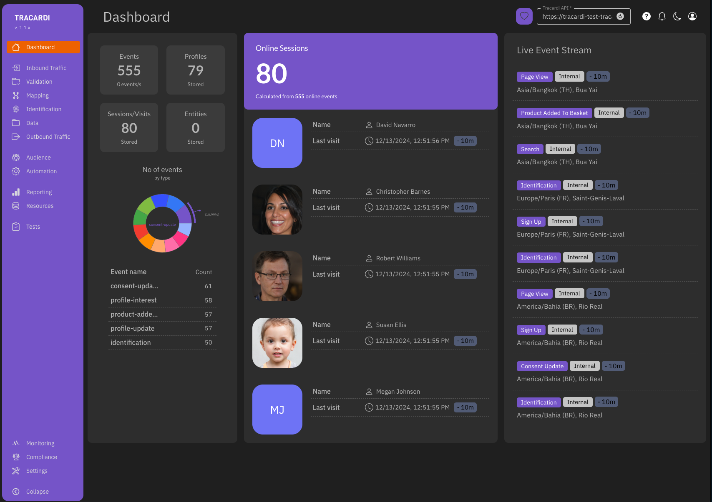

<!-- generated -->

# Tracardi

1-Click installation template for Tracardi on Easypanel

## Description

Tracardi is an open-source customer data platform (CDP) designed for real-time data processing, customer segmentation, and workflow automation. It enables businesses to collect, process, and analyze customer data while offering actionable insights. Tracardi provides a powerful visual interface, robust API support, and scalable deployment options.

## Instructions

Configure the API Domain in the GUI.

## Benefits

- Real-Time Customer Data Processing: Tracardi processes and analyzes customer data in real time, enabling you to make quick, data-driven decisions.
- Open-Source and Flexible: Tracardi is fully open-source, offering flexibility to customize and extend its capabilities based on your needs.
- Workflow Automation: Automate customer interactions with powerful visual workflows and event-driven triggers.

## Features

- Real-Time Event Processing: Process events in real time to capture and act on customer interactions as they happen.
- Customer Segmentation: Segment customers into groups based on behavior, demographics, or custom attributes.
- Visual Workflow Builder: Build automated workflows easily with a drag-and-drop interface.
- Scalable and Multi-Platform Support: Deploy Tracardi in scalable environments with Docker and multi-platform compatibility.

## Links

- [Documentation](https://docs.tracardi.com)
- [GitHub](https://github.com/Tracardi/tracardi)
- [Template Source](https://github.com/easypanel-io/templates/tree/main/templates/tracardi)

## Options

Name | Description | Required | Default Value
-|-|-|-
App Service Name | - | yes | tracardi
GUI Service Image | - | yes | tracardi/tracardi-gui:1.1.0
API Service Image | - | yes | tracardi/tracardi-api:1.1.0
APM Service Image | - | yes | tracardi/apm:1.1.0
Worker Service Image | - | yes | tracardi/update-worker:1.1.0
Elasticsearch Service Image | - | yes | docker.elastic.co/elasticsearch/elasticsearch:7.13.2
Enable Demo Data | - | yes | 
Enable Production Setup | Prevents adding demo data. | yes | 

## Screenshots

## Change Log

- 2024-12-13 – Template Release

## Contributors

- [Ahson Shaikh](https://github.com/Ahson-Shaikh)
