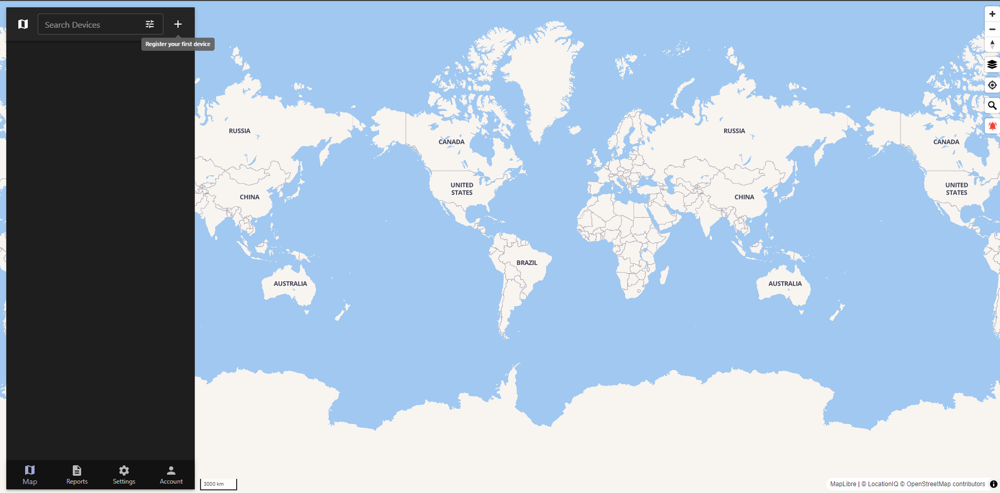

<!-- generated -->

# Traccar

1-Click installation template for Traccar on Easypanel

## Description

Traccar is an open-source GPS tracking system designed for real-time tracking of vehicles, assets, and individuals. It supports a wide range of GPS devices and mobile apps, providing a secure, reliable, and highly customizable platform for tracking and managing your data. Traccar is ideal for fleet management, personal tracking, and asset monitoring.

## Benefits

- Real-Time GPS Tracking: Monitor the location of vehicles, assets, or individuals in real time with detailed data.
- Device Compatibility: Supports over 2,000 GPS devices and mobile apps for seamless integration.
- Self-Hosted Solution: Maintain full control of your data with a secure and self-hosted platform.

## Features

- Geofencing: Create virtual boundaries and receive alerts when devices enter or exit predefined areas.
- Event Notifications: Configurable notifications for events like speeding, SOS signals, or geofence breaches.
- Multi-Device Support: Manage and monitor multiple devices from a single interface.
- Customizable Dashboards: Personalize dashboards with the data and views most relevant to your needs.

## Links

- [Website](https://www.traccar.org/)
- [Github](https://github.com/traccar/traccar)
- [Template Source](https://github.com/easypanel-io/templates/tree/main/templates/traccar)

## Options

Name | Description | Required | Default Value
-|-|-|-
App Service Name | - | yes | traccar
App Service Image | - | yes | traccar/traccar:6

## Screenshots

## Change Log

- 2024-11-30 – Template Release

## Contributors

- [Ahson Shaikh](https://github.com/Ahson-Shaikh)
