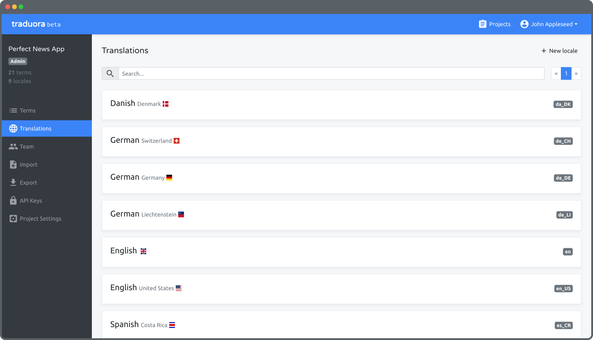

<!-- generated -->

# Traduora

1-Click installation template for Traduora on Easypanel

## Description

Traduora is a modern, self-hosted translation management platform designed for teams and developers. It provides a clean and intuitive interface for managing translation projects across multiple languages. With Traduora, you can easily import and export translations in various formats, collaborate with translators, and integrate translations into your applications via API. The platform supports real-time updates, version control of translations, and role-based access control to manage translator permissions. Traduora helps streamline the localization workflow by providing a centralized place to manage all your translation needs while maintaining full control over your translation data and processes.

## Benefits

- Centralized Translation Management: Traduora provides a centralized platform to manage all your translation projects and content in one place.
- Self-Hosted Solution: Maintain full control over your translation data with a secure, self-hosted platform.
- Team Collaboration: Enable efficient collaboration between developers, translators and project managers with role-based access.

## Features

- API Integration: Seamlessly integrate translations into your applications using the comprehensive REST API.
- Multiple Format Support: Import and export translations in various formats including JSON, YAML, and CSV.
- Version Control: Track changes and maintain version history of all translations.
- Real-time Updates: See translation changes instantly with real-time synchronization across the platform.

## Links

- [Documentation](https://docs.traduora.co/docs/getting-started)
- [Github](https://github.com/traduora/traduora)
- [Template Source](https://github.com/easypanel-io/templates/tree/main/templates/traduora)

## Options

Name | Description | Required | Default Value
-|-|-|-
App Service Name | - | yes | traduora
App Service Image | - | yes | everco/ever-traduora:v0.20.1

## Screenshots

## Change Log

- 2025-03-19 – Template Release

## Contributors

- [Ahson Shaikh](https://github.com/Ahson-Shaikh)
