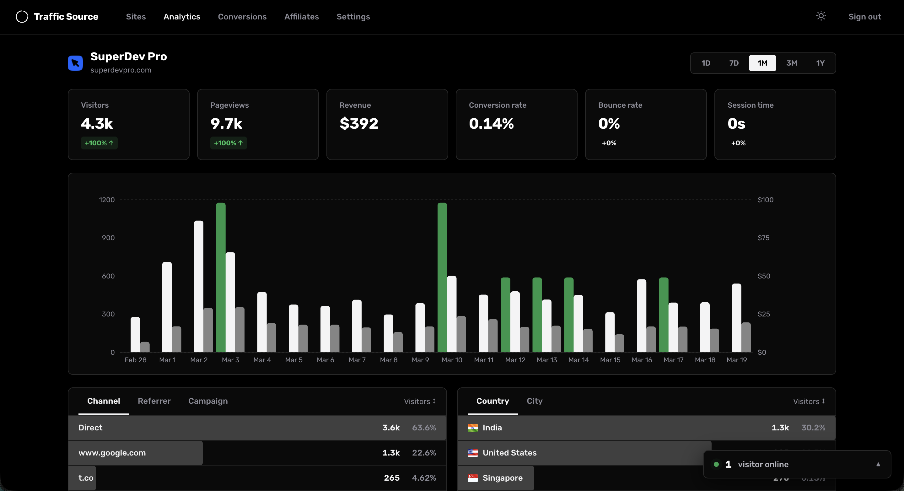

<!-- generated -->

# Traffic Source

1-Click installation template for Traffic Source on Easypanel

## Description

Traffic Source is an open-source, self-hosted web analytics platform for tracking pageviews, referrers, UTM attribution, visitor journeys, and conversions. It is cookie-free by default, supports multi-site tracking, and stores data locally in SQLite so you keep full ownership. It also includes affiliate tracking and Stripe conversion syncing.

## Instructions

After deploy, open the app and create the first user (registration is only
available for the first account). Then create a site and add the tracking
script snippet from your instance to your website. For geo data, place the
app behind Cloudflare proxy as documented upstream.

## Benefits

- Privacy-first analytics: Cookie-free tracking and fully self-hosted storage so your traffic data stays on your infrastructure.
- Conversion attribution: Link visits to conversions with built-in Stripe sync and referral attribution support.
- Multi-site dashboard: Track multiple websites from one dashboard with source and campaign breakdowns.
- Simple operations: SQLite-backed deployment with a single app service and persistent volume.

## Features

- Real-time analytics: Live pageviews, sessions, bounce rate, session duration, and traffic source insights.
- UTM and referrer tracking: Capture source, medium, campaign, term, and content attribution data.
- Visitor journeys: Inspect session paths to understand how visitors move before converting.
- Affiliate system: Manage affiliate links, commissions, and public affiliate dashboards.
- Lightweight tracking script: Small script with SPA navigation support to capture pageviews accurately.

## Links

- [Website](https://trafficsource.app)
- [GitHub](https://github.com/mddanishyusuf/traffic-source)
- [Documentation](https://github.com/mddanishyusuf/traffic-source#readme)
- [Template Source](https://github.com/easypanel-io/templates/tree/main/templates/traffic-source)

## Options

Name | Description | Required | Default Value
-|-|-|-
App Service Name | - | yes | traffic-source
JWT Expiry | - | no | 7d

## Screenshots

## Change Log

- 2026-03-24 – First Release

## Contributors

- [Ahson Shaikh](https://github.com/Ahson-Shaikh)
