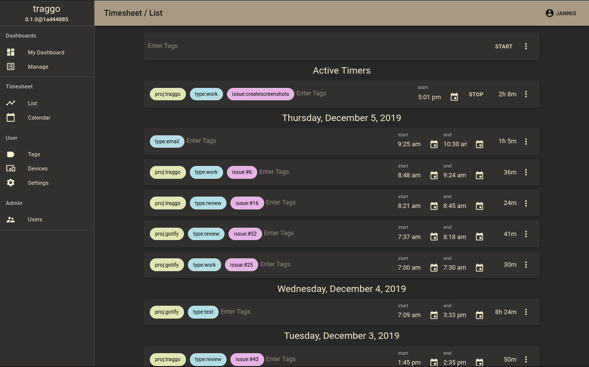

<!-- generated -->

# Traggo

1-Click installation template for Traggo on Easypanel

## Description

Traggo is a powerful, self-hosted time tracking and project management tool designed to help teams and individuals organize their workflows and track time efficiently. It features an intuitive interface, flexible reporting, and customizable dashboards. With Traggo, you can maintain complete control over your data, ensuring privacy and productivity.

## Benefits

- Efficient Time Tracking: Traggo provides intuitive tools for logging time and managing projects effectively.
- Self-Hosted Solution: Take full control of your data and privacy with this self-hosted platform.
- Flexible Reporting: Generate detailed reports to track progress and measure team productivity.

## Features

- Time Logging: Easily track and log time for various tasks and projects.
- Custom Dashboards: Personalize your dashboards to suit your workflow and preferences.
- Team Collaboration: Enable seamless collaboration with role-based permissions and shared views.
- Export Options: Export reports and logs in multiple formats for external use.

## Links

- [Website](https://traggo.net/)
- [Github](https://github.com/traggo/server)
- [Template Source](https://github.com/easypanel-io/templates/tree/main/templates/traggo)

## Options

Name | Description | Required | Default Value
-|-|-|-
App Service Name | - | yes | traggo
App Service Image | - | yes | traggo/server:0.6.0
Traggo Username | - | yes | admin
Traggo Password | - | yes | 

## Screenshots

## Change Log

- 2024-11-27 – Template Release

## Contributors

- [Ahson Shaikh](https://github.com/Ahson-Shaikh)
