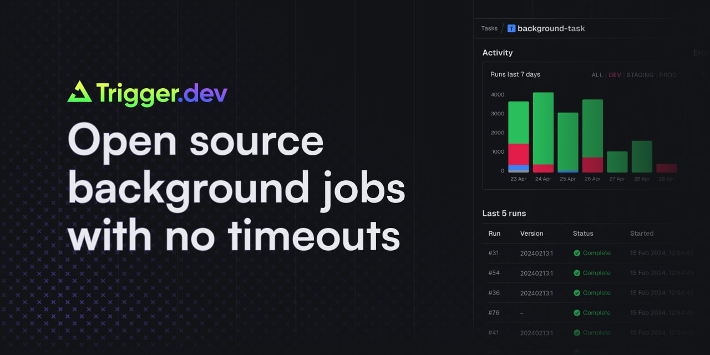

<!-- generated -->

# Trigger

1-Click installation template for Trigger on Easypanel

## Description

Trigger.dev is a free and open-source platform that simplifies building workflows and automations directly within your codebase. It provides a powerful way to connect your application to APIs, schedule tasks, and manage real-time and delayed workflows with ease. By integrating seamlessly into your development process, Trigger.dev allows developers to focus on delivering high-value features instead of managing complex infrastructure. Its scalability and ease of use make it a great fit for modern web applications and cloud-based systems.

## Instructions

You should connect your application to Trigger.dev using the provided SDKs and API endpoints for effortless workflow automation.

## Benefits

- Code-First Workflow Automation: Build workflows directly in your codebase for seamless integration with your application and development process.
- API Integrations: Easily connect to external APIs and manage complex integrations with minimal effort.
- Real-Time and Delayed Workflows: Manage real-time triggers and delayed workflows for advanced automation scenarios.

## Features

- Workflow Management: Trigger.dev allows you to build, test, and deploy workflows directly from your development environment.
- API Integration: Simplify API connections and data transfers with built-in support for multiple APIs and webhooks.
- Real-Time and Scheduled Events: Handle real-time events and schedule tasks with precision and reliability.
- Open Source: Fully open source and community-driven, making it easy to adapt and enhance for your needs.
- Extensible: Extend Trigger.dev’s capabilities through custom modules and plugins.

## Links

- [Website](https://trigger.dev/)
- [Documentation](https://docs.trigger.dev/)
- [Github](https://github.com/triggerdotdev/trigger.dev)
- [Template Source](https://github.com/easypanel-io/templates/tree/main/templates/trigger)

## Options

Name | Description | Required | Default Value
-|-|-|-
App Service Name | - | yes | trigger
App Service Image | - | yes | ghcr.io/triggerdotdev/trigger.dev:v2.2.39
Database Service Name | - | yes | trigger-db

## Screenshots

## Change Log

- 2024-11-16 – First Release

## Contributors

- [Ahson Shaikh](https://github.com/Ahson-Shaikh)
