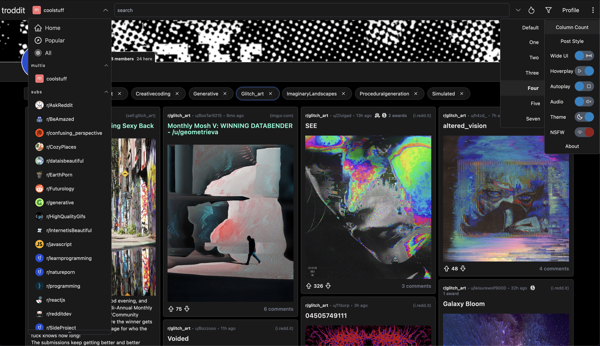

<!-- generated -->

# Troddit

1-Click installation template for Troddit on Easypanel

## Description

Troddit is a web-based Reddit client that provides a clean, modern interface for browsing Reddit. It offers an alternative frontend experience with improved user interface design and functionality. Troddit allows users to browse subreddits, view posts, and navigate Reddit content through a streamlined web interface without requiring the official Reddit app or website.

## Benefits

- Modern Reddit Interface: Clean and modern web interface for browsing Reddit content with improved user experience compared to the official Reddit website.
- Self-hosted Solution: Host your own instance of Troddit for privacy and customization, giving you control over your Reddit browsing experience.
- Lightweight Alternative: A lightweight alternative to the official Reddit app and website, providing faster loading times and better performance.
- Easy Deployment: Simple Docker-based deployment that gets you up and running quickly with minimal configuration required.

## Features

- Subreddit Browsing: Browse any public subreddit with an intuitive interface
- Post Viewing: View Reddit posts, comments, and media content seamlessly
- Clean Design: Modern, clean interface that enhances the Reddit browsing experience
- Responsive Layout: Works well on both desktop and mobile devices
- Fast Performance: Optimized for speed and performance with efficient loading
- Privacy Focused: Self-hosted solution that keeps your browsing data private

## Links

- [GitHub](https://github.com/burhan-syed/troddit)
- [Website](https://www.troddit.com)
- [Template Source](https://github.com/easypanel-io/templates/tree/main/templates/troddit)

## Options

Name | Description | Required | Default Value
-|-|-|-
App Service Name | - | yes | troddit
App Service Image | - | yes | bsyed/troddit:latest

## Screenshots

## Change Log

- 2025-07-09 – Initial release

## Contributors

- [Ahson Shaikh](https://github.com/Ahson-Shaikh)
