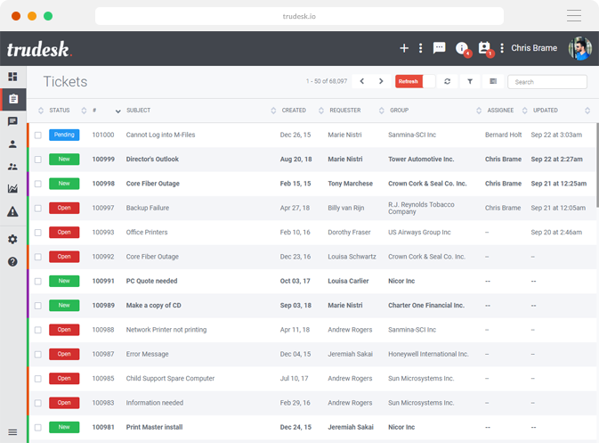

<!-- generated -->

# Trudesk

1-Click installation template for Trudesk on Easypanel

## Description

Trudesk is a self-hosted, open-source help desk and ticketing system designed for businesses and teams to efficiently manage customer support inquiries. It provides a modern and user-friendly web interface for tracking, organizing, and resolving support tickets. Trudesk includes role-based user management, real-time notifications, reporting tools, and an API for integration with other services. It supports multiple authentication methods, including OAuth and LDAP, making it suitable for enterprise environments. Additionally, Trudesk offers email integration, enabling automatic ticket creation from emails. With its containerized deployment, it ensures scalability and ease of management.

## Benefits

- Efficient Ticket Management: Trudesk provides an intuitive help desk system that allows teams to track, assign, and resolve customer support tickets in an organized manner.
- Self-Hosted Support Solution: Businesses can maintain full control over their support system, ensuring security, privacy, and customization without relying on third-party services.
- Automation & Integrations: Trudesk supports automation workflows, APIs, and third-party integrations to streamline customer service processes.

## Features

- Role-Based Access Control: Trudesk provides multi-user role management, allowing teams to define access levels and permissions for agents, managers, and administrators.
- Real-Time Notifications: Get instant alerts for new tickets, updates, and responses through in-app, email, or push notifications.
- API & Third-Party Integrations: Trudesk provides a RESTful API for integrating with CRM, monitoring tools, and other business applications.
- Email-to-Ticket System: Automatically convert incoming emails into support tickets to streamline customer inquiries.
- Reporting & Analytics: Track agent performance, ticket resolution times, and other key support metrics through built-in reports and analytics.

## Links

- [Documentation](https://docs.trudesk.io)
- [Github](https://github.com/polonel/trudesk)
- [Template Source](https://github.com/easypanel-io/templates/tree/main/templates/trudesk)

## Options

Name | Description | Required | Default Value
-|-|-|-
App Service Name | - | yes | trudesk
App Service Image | - | yes | polonel/trudesk:1.2.11

## Screenshots

## Change Log

- 2025-03-18 – Template Release

## Contributors

- [Ahson Shaikh](https://github.com/Ahson-Shaikh)
