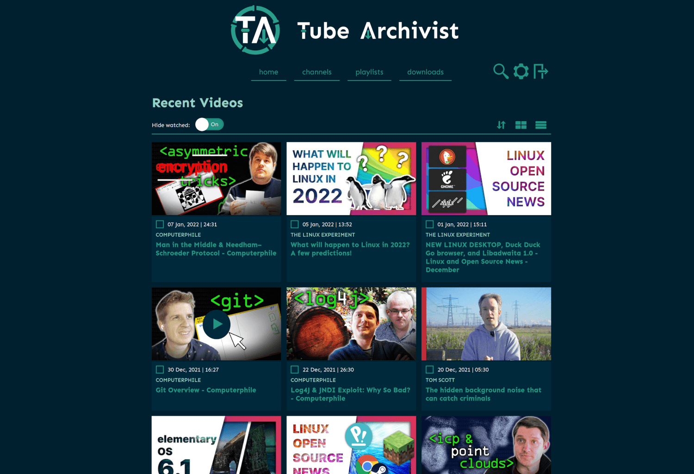

<!-- generated -->

# TubeArchivist

1-Click installation template for TubeArchivist on Easypanel

## Description

TubeArchivist is a self-hosted YouTube archiving tool that allows you to manage and organize your YouTube content locally. It downloads videos, indexes metadata, and provides a web-based interface for searching, organizing, and playing content. Designed for personal use, TubeArchivist integrates with Elasticsearch for advanced search capabilities and Redis for optimized caching and task management. It also supports custom playlists, video tagging, and offline playback, providing complete control over your video collection.

## Benefits

- Personal YouTube Archive: TubeArchivist allows you to create your own YouTube archive. You can download and organize videos locally, giving you full control over your collection and ensuring access even if the original content is removed.
- Advanced Search and Metadata Indexing: With Elasticsearch integration, TubeArchivist offers powerful search capabilities. You can search by video title, description, tags, and more, making it easy to find the content you want.
- Offline Playback and Organization: TubeArchivist supports offline playback of downloaded videos. Organize content into custom playlists, apply tags, and manage your collection efficiently.

## Features

- Elasticsearch Integration: TubeArchivist uses Elasticsearch for advanced search and metadata indexing, providing fast and accurate search results across your video archive.
- Redis Caching: Redis is used for caching and task management, improving the performance and responsiveness of the TubeArchivist interface.
- Custom Playlists and Tagging: Create custom playlists and apply tags to organize your content. This helps you manage your collection and find videos easily.
- Scheduled Downloads: TubeArchivist supports scheduled downloads, allowing you to automate the archiving process for your favorite YouTube channels and playlists.
- Web-Based Interface: The intuitive web-based interface makes it easy to manage your video archive, search content, and control playback from any device.

## Links

- [Documentation](https://github.com/tubearchivist/tubearchivist/wiki)
- [Dockerhub](https://hub.docker.com/r/bbilly1/tubearchivist)
- [Template Source](https://github.com/easypanel-io/templates/tree/main/templates/tubearchivist)

## Options

Name | Description | Required | Default Value
-|-|-|-
App Service Name | - | yes | tubearchivist
App Service Image | - | yes | bbilly1/tubearchivist:v0.5.4
Elasticsearch Service Image | - | yes | bbilly1/tubearchivist-es:8.18.0
Redis Service Image | - | yes | redis/redis-stack-server:7.4.0-v6
Username | - | yes | admin
Password | - | yes | changeme

## Screenshots

## Change Log

- 2025-02-13 – First Release
- 2025-07-25 – Version bumped to v0.5.4

## Contributors

- [Ahson Shaikh](https://github.com/Ahson-Shaikh)
