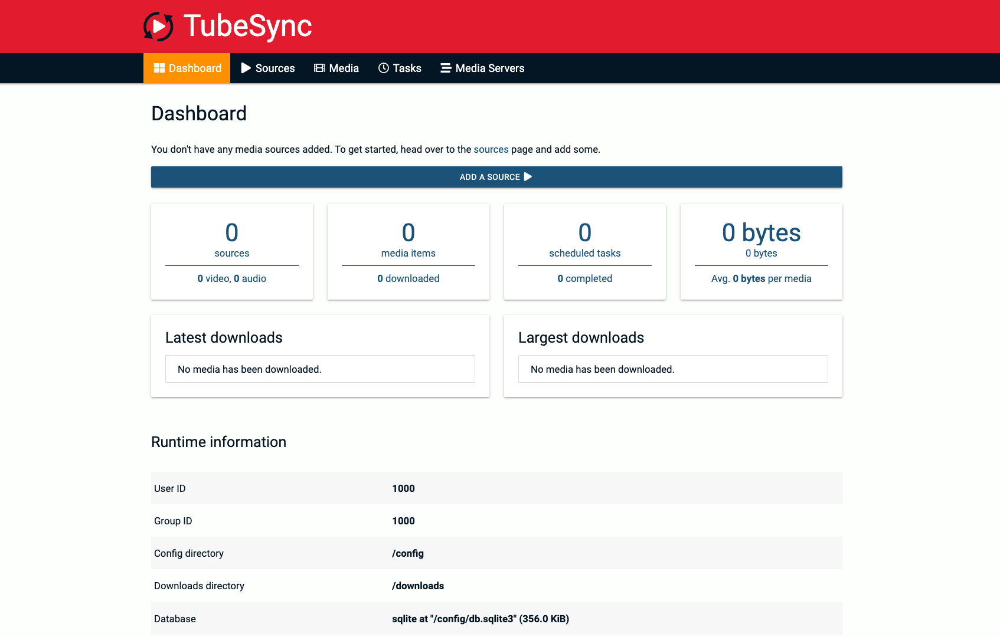

<!-- generated -->

# TubeSync

1-Click installation template for TubeSync on Easypanel

## Description

TubeSync is a powerful self-hosted application designed to automatically sync and download YouTube videos from subscriptions or playlists. It provides an intuitive web interface to manage downloads, supports filtering by keywords, and integrates with various media management systems. TubeSync allows users to schedule automatic downloads, ensuring they never miss new content from their favorite channels. It is built for efficiency, offering high-speed downloads and optimized storage handling. The application runs as a lightweight container, making it easy to deploy and manage.

## Benefits

- Automatic YouTube Video Sync: TubeSync automatically downloads new videos from your favorite YouTube channels and playlists, ensuring you never miss an upload.
- Smart Filtering: With advanced keyword filtering, TubeSync allows you to choose specific videos to download based on titles, descriptions, or tags.
- Easy Integration with Media Libraries: TubeSync works seamlessly with popular media management tools like Plex and Jellyfin, making it easy to organize and stream downloaded content.

## Features

- Subscription Management: Users can subscribe to YouTube channels and playlists, and TubeSync will automatically download new videos as they are released.
- Keyword-Based Filtering: Define specific keywords to filter downloads, ensuring only relevant content is saved.
- Scheduled Downloads: Schedule automatic video downloads at set intervals to keep your media library updated without manual intervention.
- Web-Based UI: Manage subscriptions, view download history, and configure settings through an intuitive web-based interface.
- Metadata and Thumbnail Handling: TubeSync automatically fetches video metadata and thumbnails, making it easy to organize and categorize downloaded videos.

## Links

- [Github](https://github.com/meeb/tubesync)
- [Template Source](https://github.com/easypanel-io/templates/tree/main/templates/tubesync)

## Options

Name | Description | Required | Default Value
-|-|-|-
App Service Name | - | yes | tubesync
App Service Image | - | yes | ghcr.io/meeb/tubesync:v0.13.7
Username | - | yes | admin
Password | - | yes | password

## Screenshots

## Change Log

- 2025-02-25 – first release

## Contributors

- [Ahson-Shaikh](https://github.com/Ahson-Shaikh)
