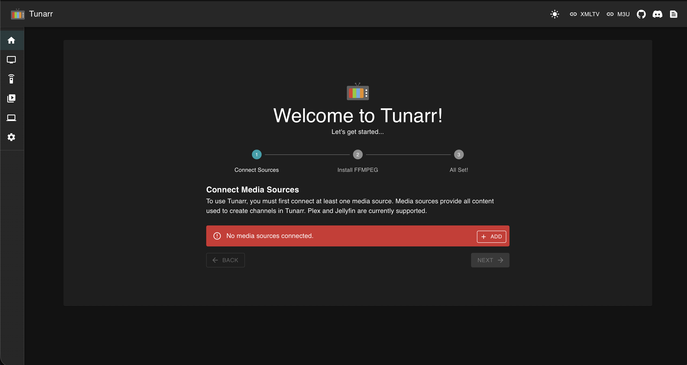

<!-- generated -->

# Tunarr

1-Click installation template for Tunarr on Easypanel

## Description

Tunarr is a modern IPTV server that creates custom TV channels from your personal media library. It automatically generates continuous programming schedules using your movies, TV shows, and other content, creating an authentic TV viewing experience. Tunarr provides intelligent scheduling, program guide generation, and seamless integration with popular media libraries like Plex, Jellyfin, and Emby. Perfect for home entertainment setups, it transforms your digital media collection into personalized TV channels that can be watched on any IPTV-compatible device or application.

## Instructions

After deployment, access Tunarr through your domain. The web interface will guide you through the initial setup process. You&#39;ll need to configure your media library connections (Plex, Jellyfin, Emby, or local files), set up TV channels and programming schedules, and configure your IPTV player to connect to the generated M3U playlist. Tunarr will automatically scan your media library and create intelligent programming schedules for your custom TV channels.

## Benefits

- Intelligent Scheduling: Automatically creates realistic TV programming schedules from your media library with smart content selection and timing.
- Media Library Integration: Seamlessly integrates with Plex, Jellyfin, Emby, and local file systems for comprehensive media library support.
- Program Guide Generation: Generates detailed EPG (Electronic Program Guide) data with accurate scheduling and program information for your channels.
- Modern Web Interface: Clean, intuitive web interface for easy channel configuration, media management, and real-time monitoring of your TV streams.

## Features

- Multi-Source Support: Connect multiple media libraries and sources to create diverse TV channels with content from different platforms.
- Advanced Channel Configuration: Fine-tune channel settings, programming rules, and content filters to create exactly the TV experience you want.
- Commercial Management: Insert commercials, bumpers, and station identification between programs to create authentic TV channel experience.
- IPTV Standard Compliance: Generates standard M3U playlists and EPG data compatible with any IPTV player or device for universal compatibility.

## Links

- [Website](https://tunarr.com)
- [GitHub](https://github.com/chrisbenincasa/tunarr)
- [Documentation](https://tunarr.com/api-docs)
- [Docker Hub](https://hub.docker.com/r/chrisbenincasa/tunarr)
- [Template Source](https://github.com/easypanel-io/templates/tree/main/templates/tunarr)

## Options

Name | Description | Required | Default Value
-|-|-|-
App Service Name | - | yes | tunarr
App Service Image | - | yes | chrisbenincasa/tunarr:0.22.6
Log Level | Application logging level | no | INFO
Timezone | Timezone for accurate guide data and scheduling | no | Etc/UTC
Database Path (Optional) | Custom path for Tunarr database storage | no | 

## Screenshots

## Change Log

- 2025-10-14 – Initial Template Release

## Contributors

- [Ahson Shaikh](https://github.com/Ahson-Shaikh)
