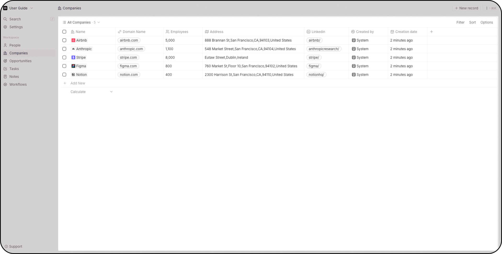

<!-- generated -->

# Twenty CRM

1-Click installation template for Twenty CRM on Easypanel

## Description

Twenty is a modern, open-source CRM platform designed to help businesses manage their customer relationships efficiently.  It offers a user-friendly interface for tracking contacts, organizations, and opportunities while providing powerful customization options.

## Instructions

Twenty CRM is deployed with a server and a background worker service. The SERVER_URL is automatically set to the Easypanel-generated domain. If you configure a custom domain for the Twenty service, also update the SERVER_URL environment variable in the worker service to match.

## Benefits

- Modern User Interface: Twenty CRM offers a clean, intuitive user interface that makes managing customer relationships simple and efficient.
- Open Source: As an open-source platform, Twenty CRM provides full transparency, customizability, and no vendor lock-in.
- Customizable: Easily adapt the CRM to your specific business needs with extensive customization options.
- Scalable: Built with modern technologies, Twenty CRM scales with your business from startups to enterprises.

## Features

- Contact Management: Easily manage and organize your contacts with comprehensive profiles and interaction history.
- Organization Tracking: Keep track of companies, their contacts, and business opportunities in one place.
- Task Management: Create, assign, and track tasks to ensure nothing falls through the cracks.
- Customizable Workflows: Adapt the CRM's workflows to match your specific business processes.
- Data Import/Export: Easily import existing contact data or export data for use in other systems.

## Links

- [Website](https://twenty.com/)
- [Documentation](https://docs.twenty.com/)
- [Github](https://github.com/twentyhq/twenty)
- [Template Source](https://github.com/easypanel-io/templates/tree/main/templates/twenty)

## Options

Name | Description | Required | Default Value
-|-|-|-
App Service Name | - | yes | twenty
App Service Image | - | yes | twentycrm/twenty:v2.5.3

## Screenshots

## Change Log

- 2025-05-22 – First release
- 2025-08-19 – Update to v1.3.0
- 2026-05-18 – Major Update to v2.5.3 with new features and improvements

## Contributors

- [Ahson Shaikh](https://github.com/Ahson-Shaikh)
