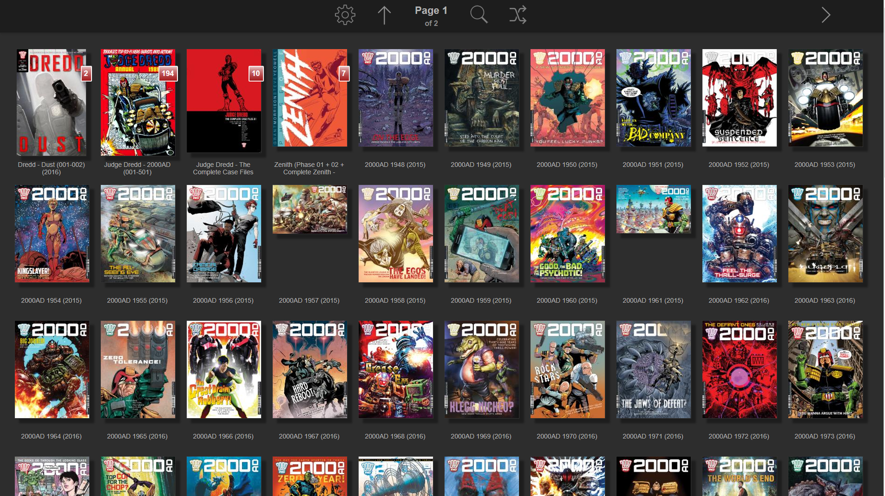

<!-- generated -->

# Ubooquity

1-Click installation template for Ubooquity on Easypanel

## Description

Ubooquity is a free, lightweight and easy-to-use home server for your comics and ebooks. It provides a clean web interface to browse, read, and organize your digital library from any device. Ubooquity supports various formats including CBZ, CBR, CB7, PDF, EPUB, and many more. It features user management, reading progress tracking, and can serve your media collection to multiple users simultaneously. The server includes both a library interface for browsing and an admin interface for configuration, making it perfect for managing your digital book and comic collection at home.

## Benefits

- Easy Digital Library Management: Organize and browse your comics and ebooks through a clean web interface accessible from any device.
- Multiple Format Support: Supports CBZ, CBR, CB7, PDF, EPUB, and many other digital book and comic formats.
- User Management: Create multiple user accounts with different access levels for family members or friends.
- Reading Progress Tracking: Keep track of your reading progress across devices and resume where you left off.
- Lightweight and Fast: Minimal resource usage with fast browsing and reading experience for large libraries.

## Features

- Media Server: Serves your digital book and comic collection through a centralized web-based platform accessible from any device
- Ebook Reader: Built-in web reader supporting EPUB, PDF, MOBI, and other popular ebook formats with customizable reading experience
- Comic Reader: Dedicated comic reader with page-by-page navigation supporting CBZ, CBR, CB7, and PDF comic formats
- Library Management: Organize and categorize your digital collection with automatic metadata extraction and custom folder structures
- Web Interface: Clean, responsive web interface that works seamlessly across desktop, tablet, and mobile devices
- User Management: Create multiple user accounts with different access levels and reading permissions for family or shared use
- Reading Progress: Automatic bookmark system that tracks reading progress across devices and allows resuming from where you left off
- Multi-Format Support: Comprehensive support for various digital book and comic formats including CBZ, CBR, CB7, PDF, EPUB, MOBI, and more
- Digital Library: Transform your local book and comic collection into a professionally organized digital library with search capabilities
- Home Server: Self-hosted solution that keeps your digital media collection private and accessible only to authorized users

## Links

- [Website](https://vaemendis.net/ubooquity/)
- [Documentation](https://vaemendis.github.io/ubooquity-doc/pages/installation-guide.html)
- [GitHub](https://github.com/vaemendis/ubooquity-doc)
- [Template Source](https://github.com/easypanel-io/templates/tree/main/templates/ubooquity)

## Options

Name | Description | Required | Default Value
-|-|-|-
App Service Name | - | yes | ubooquity
App Service Image | - | yes | lscr.io/linuxserver/ubooquity:2.1.5
App Service Port | - | yes | 2202

## Screenshots

## Change Log

- 2025-07-14 – Initial template release
- 2026-04-19 – Added GitHub link (official documentation repository)

## Contributors

- [Ahson Shaikh](https://github.com/Ahson-Shaikh)
