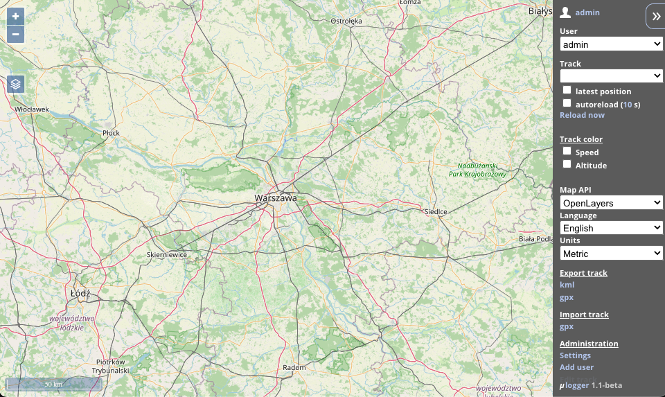

<!-- generated -->

# uLogger

1-Click installation template for uLogger on Easypanel

## Description

uLogger is a lightweight, self-hosted GPS tracking platform that allows you to track and visualize your location data. It&#39;s perfect for personal use, fleet management, or tracking outdoor activities.

## Benefits

- Self-hosted GPS Tracking: Keep your location data private by hosting your own GPS tracking platform
- Lightweight Solution: Minimal resource requirements make it perfect for small deployments
- Multi-language Support: Available in multiple languages for global accessibility
- Open Source: Free and open-source platform with active community support

## Features

- GPS Tracking: Track and record location data with high precision
- Web Interface: User-friendly web interface for viewing and managing tracks
- Mobile Support: Compatible with various GPS tracking apps for mobile devices
- Track Management: Organize and manage multiple tracks with ease
- Data Export: Export your tracking data in various formats
- Customizable: Configure language and other settings to suit your needs

## Links

- [GitHub](https://github.com/bfabiszewski/ulogger-server)
- [Docker Hub](https://hub.docker.com/r/bfabiszewski/ulogger)
- [Template Source](https://github.com/easypanel-io/templates/tree/main/templates/ulogger)

## Options

Name | Description | Required | Default Value
-|-|-|-
App Service Name | - | yes | ulogger
App Service Image | - | yes | bfabiszewski/ulogger:v1.0

## Screenshots

## Change Log

- 2025-04-30 – Initial release

## Contributors

- [Ahson Shaikh](https://github.com/Ahson-Shaikh)
