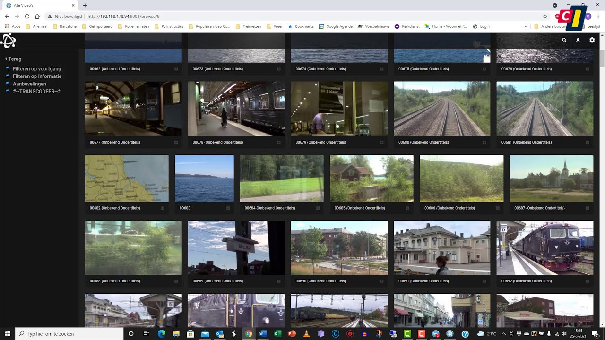

<!-- generated -->

# Universal Media Server

1-Click installation template for Universal Media Server on Easypanel

## Description

Universal Media Server (UMS) is a DLNA-compliant media server that can share videos, audio, and images to any DLNA-capable device, including smart TVs, game consoles, mobile devices, and other computers. It supports a wide range of formats and offers extensive customization options for transcoding and streaming.

## Instructions

Mount your media library to the `ums-media` volume at `/root/media`, then open Universal Media Server from your Easypanel domain and complete the initial library scan and device discovery setup.

## Benefits

- Universal Compatibility: Stream to virtually any device including smart TVs, game consoles, and mobile devices
- Format Support: Support for an extensive range of audio and video formats with on-the-fly transcoding
- No Client Required: Works with native DLNA clients already built into many devices
- Lightweight & Efficient: Designed to run efficiently even on modest hardware

## Features

- DLNA/UPnP Compliance: Fully compatible with DLNA and UPnP standards for seamless streaming
- Automatic Transcoding: Automatically converts media to formats supported by the target device
- Subtitle Support: Handles external and embedded subtitles in various formats
- Web Interface: User-friendly web interface for configuration and media management
- Thumbnail Generation: Automatically generates thumbnails and previews for media
- Media Library Organization: Sorts and categorizes media for easy browsing

## Links

- [Website](https://www.universalmediaserver.com/)
- [GitHub](https://github.com/UniversalMediaServer/UniversalMediaServer)
- [Docker Hub](https://hub.docker.com/r/universalmediaserver/ums)
- [Template Source](https://github.com/easypanel-io/templates/tree/main/templates/universalmediaserver)

## Options

Name | Description | Required | Default Value
-|-|-|-
App Service Name | - | yes | universalmediaserver
App Service Image | - | yes | universalmediaserver/ums:14.12.0

## Screenshots

## Change Log

- 2025-04-25 – Initial release

## Contributors

- [Ahson Shaikh](https://github.com/Ahson-Shaikh)
