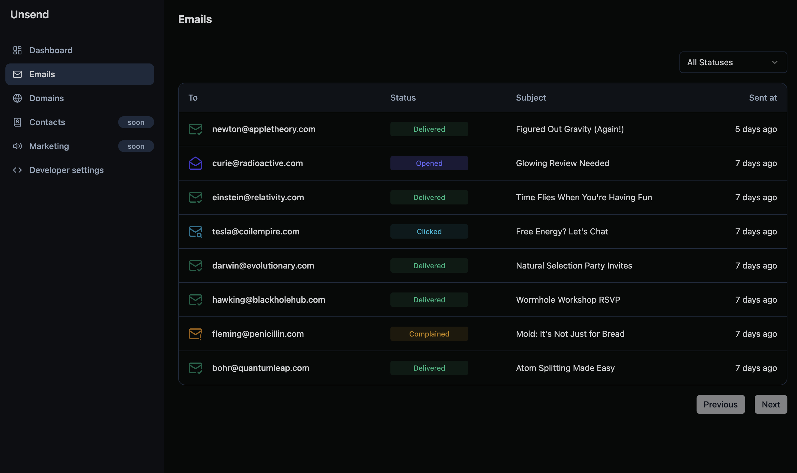

<!-- generated -->

# Unsend

1-Click installation template for Unsend on Easypanel

## Description

Unsend is a self-hosted, alternative email-sending platform that provides a reliable and cost-effective way to send emails using Amazon SES. With a powerful dashboard, Unsend allows users to manage contacts, send bulk emails (such as newsletters and product updates), and handle subscriptions seamlessly. Future updates aim to support additional communication channels, including SMS, push notifications, and WhatsApp.

## Instructions

You can use Minio for S3 Compatibility and provide AWS like credentials for it.

## Benefits

- Reliable and Cost-Effective Email Sending: Unsend leverages Amazon SES to provide a scalable and affordable alternative to traditional email providers.
- Self-Hosted for Full Control: Unlike SaaS email platforms, Unsend allows you to host your own instance, ensuring full control over email deliverability and data security.
- Bulk Email Management: Unsend makes it easy to manage contacts and send bulk emails, such as newsletters, transactional emails, and product updates.
- Subscription Handling: Unsend automatically manages email subscriptions and opt-outs, ensuring compliance with user preferences.
- Future Multi-Channel Support: Future updates aim to expand Unsend to support SMS, push notifications, and WhatsApp messaging.

## Features

- Amazon SES Integration: Unsend seamlessly integrates with Amazon SES for reliable email delivery.
- Contact Management: Users can manage and organize email contacts through a user-friendly dashboard.
- Bulk Email Sending: Unsend supports sending mass emails with customizable templates.
- Subscription & Unsubscription Management: Automatically handles email subscriptions and opt-outs for compliance and better user engagement.
- OAuth Integration: Supports GitHub OAuth authentication for secure and seamless login.

## Links

- [Documentation](https://unsend.dev/)
- [Github](https://github.com/unsend-dev/unsend/tree/main)
- [Template Source](https://github.com/easypanel-io/templates/tree/main/templates/unsend)

## Options

Name | Description | Required | Default Value
-|-|-|-
App Service Name | - | yes | unsend
App Service Image | - | yes | ghcr.io/unsend-dev/unsend:v1.5.5
AWS Access Key | This is the AWS Access Key associated with your AWS account. | yes | 
AWS Secret Key | This is the AWS Secret Key associated with your AWS account. | yes | 
Default Region | - | yes | us-east-1
Github ID | This is the GitHub ID associated with your GitHub account. | yes | 
Github Secret | This is the GitHub Secret associated with your GitHub account. | yes | 
Minio Image | This is the Minio image to be used for storing email attachments and | yes | minio/minio:RELEASE.2025-02-28T09-55-16Z
Minio Root Username | This is the Minio root username for accessing the Minio storage. | yes | admin
Minio Root Password | This is the Minio root password for accessing the Minio storage. | yes | admin

## Screenshots

## Change Log

- 2025-03-17 – First Release (v1.4.0)
- 2025-07-25 – Version bumped to v1.5.4
- 2025-12-29 – Version bumped to v1.5.5

## Contributors

- [Ahson Shaikh](https://github.com/Ahson-Shaikh)
