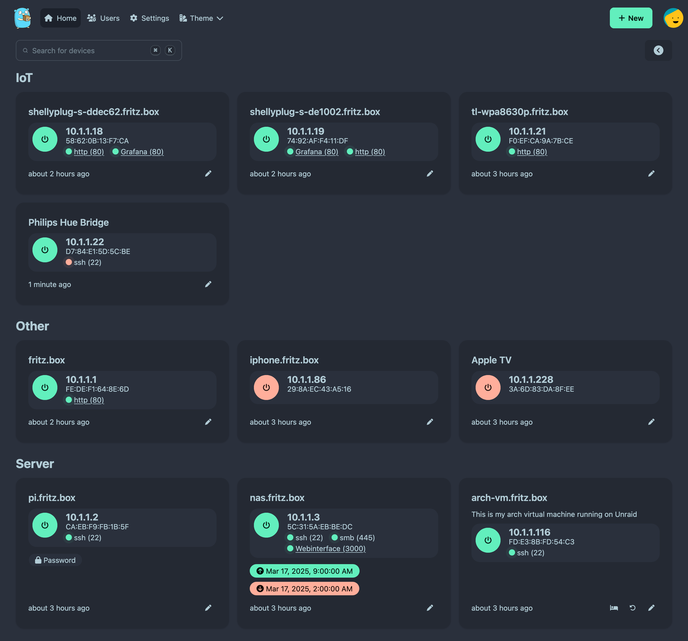

<!-- generated -->

# UpSnap

1-Click installation template for UpSnap on Easypanel

## Description

UpSnap is a self-hosted wake-on-lan (WOL) server with a modern web interface. It allows you to remotely power on computers on your local network from anywhere through an intuitive dashboard. UpSnap features device management with customizable names and MAC addresses, wake history tracking, and user authentication. Perfect for home networks, small offices, or lab environments where you need to remotely manage the power state of multiple machines.

## Instructions

Open UpSnap from your domain, create an admin account, then add your devices with their MAC addresses and host details. Ensure Wake-on-LAN is enabled in each target machine BIOS/UEFI and network adapter settings.

## Benefits

- Remote Power Management: Conveniently power on your network devices from anywhere using Wake-on-LAN technology, eliminating the need for physical access.
- Centralized Dashboard: Manage all your network devices from a single, user-friendly interface that provides quick access to power controls and device status.
- Enhanced Network Control: Gain better control over your network by being able to power on devices when needed, saving energy when machines are not in use.

## Features

- Modern Web Interface: UpSnap provides a clean, responsive web interface that works across devices and screen sizes for easy device management.
- Device Management: Add, edit, and organize multiple devices with custom names, descriptions, and MAC addresses for easy identification.
- Wake History: Keep track of when devices were powered on with a detailed history log, providing visibility into your network activity.
- User Authentication: Secure your Wake-on-LAN controls with user authentication to prevent unauthorized access and power management.
- Persistent Storage: Store your device configurations and user data securely with persistent storage that survives container restarts and updates.

## Links

- [GitHub](https://github.com/seriousm4x/upsnap)
- [Container](https://github.com/seriousm4x/upsnap/pkgs/container/upsnap)
- [Template Source](https://github.com/easypanel-io/templates/tree/main/templates/upsnap)

## Options

Name | Description | Required | Default Value
-|-|-|-
App Service Name | - | yes | upsnap
App Service Image | - | yes | ghcr.io/seriousm4x/upsnap:4

## Screenshots

## Change Log

- 2025-04-24 – first release

## Contributors

- [Ahson Shaikh](https://github.com/Ahson-Shaikh)
