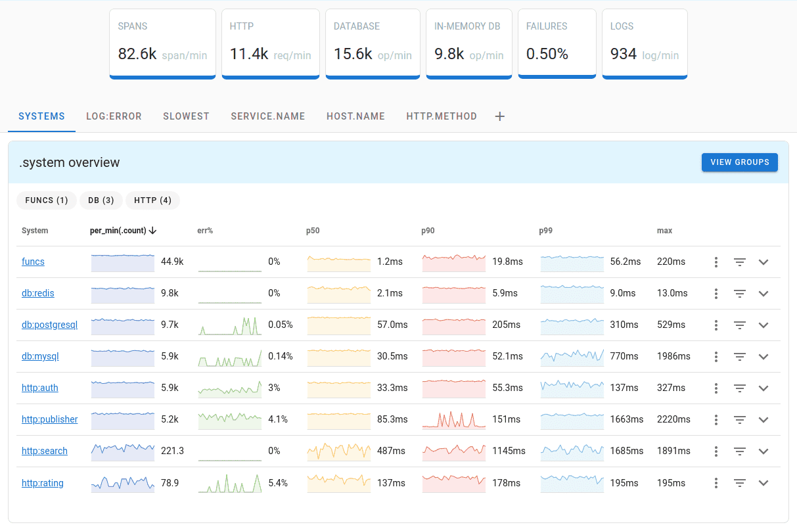

<!-- generated -->

# Uptrace

1-Click installation template for Uptrace on Easypanel

## Description

Uptrace is an open-source APM platform for traces, metrics, and logs using OpenTelemetry, with ClickHouse storage and PostgreSQL metadata. This template follows the official example/docker compose stack (Uptrace, ClickHouse, Postgres, Redis, OTel Collector, Vector, Grafana, Prometheus, Alertmanager, Mailpit). The Vector image uses timberio/vector:0.28.X-alpine to match that upstream example (legacy Docker Hub namespace); migrate to distroless/vector only when you intentionally diverge from upstream.

## Instructions

Login; Use the admin name/email/password from the template form (password is random if left blank). The project DSN token is generated once per deploy and embedded in `/etc/uptrace/config.yml`, OTel Collector, Grafana datasource, Prometheus remote_write, and Vector—keep file mounts stable or regenerate configs together. Ingestion; Published host ports match the upstream example—14317→4317 (Uptrace gRPC, referenced in `site.ingest_url`), 4317/4318 (OTLP on the collector). On shared hosts these can conflict; change published ports in Easypanel and update `ingest_url` / client endpoints accordingly. Grafana &amp; Mailpit use separate app domains on ports 3000 and 8025; assign subdomains or paths in Easypanel as needed. TLS; Upstream compose mounts TLS certs; this template omits them for HTTPS termination at the proxy—see Uptrace docs if you need in-container TLS.

## Benefits

- All-in-One Observability: Single UI for distributed traces, metrics, and logs with 50+ pre-built dashboards that auto-create when metrics start flowing.
- Cost-Effective at Scale: Process billions of spans on a single server using ClickHouse's efficient columnar storage with ZSTD compression (1KB span compresses to ~40 bytes).
- OpenTelemetry Native: Built on the OpenTelemetry standard with support for OTLP, Prometheus, Vector, FluentBit, and CloudWatch ingestion.
- Self-Hosted & Open Source: Full control over your observability data with no vendor lock-in. Deploy on your own infrastructure with complete data sovereignty.

## Features

- Distributed Tracing: Visualize request flows across services with service graphs, faceted filters, and SQL-like query language for span analysis.
- Metrics & Dashboards: PromQL-like language for metrics aggregation with 50+ auto-created dashboards and chart annotations.
- Alerting & Notifications: Monitor spans, logs, and metrics with alerts via Email, Slack, Telegram, WebHook, and AlertManager integration.
- Grafana Compatible: Use Uptrace as a Tempo and Prometheus datasource in Grafana for seamless integration with existing dashboards.
- Multi-Tenant Support: Manage multiple organizations and projects with SSO support via OpenID Connect (Keycloak, Google, Cloudflare).
- High Performance: More than 10K spans/second on a single core with excellent on-disk compression for cost-effective long-term retention.

## Links

- [Website](https://uptrace.dev)
- [GitHub](https://github.com/uptrace/uptrace)
- [Documentation](https://uptrace.dev/get)
- [Template Source](https://github.com/easypanel-io/templates/tree/main/templates/uptrace)

## Options

Name | Description | Required | Default Value
-|-|-|-
App Service Name | - | yes | uptrace
Uptrace Image | Pinned to the tag used in github.com/uptrace/uptrace example/docker docker-compose.yml; bump only with a tested exact tag. | yes | uptrace/uptrace:2.1.0-beta.4
Admin Name | - | no | Admin
Admin Email | - | no | admin@uptrace.local
Admin Password | Generated randomly if not provided. | no | 
Grafana admin password | Grafana login user is admin. Leave empty for a random password (written to grafana.ini), or set explicitly. | no | 
Organization Name | - | no | Org1
Project Name | - | no | Project1

## Screenshots

## Change Log

- 2026-03-23 – Fix ClickHouse password in config.yml to match CLICKHOUSE_PASSWORD (was hardcoded uptrace). Pin Mailpit to axllent/mailpit:v1.29.4.
- 2026-02-27 – First Release
- 2026-03-20 – Square logo, image pin 2.1.0-beta.4, random project token, richer instructions, vector/timberio parity note. Vector pin 0.28.1-alpine, Grafana admin password randomized.

## Contributors

- [Ahson Shaikh](https://github.com/Ahson-Shaikh)
