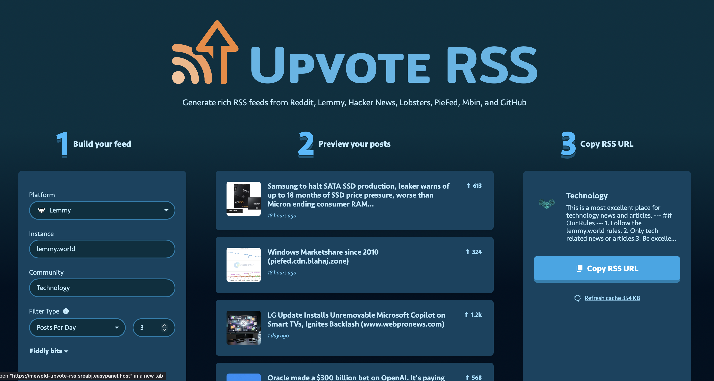

<!-- generated -->

# Upvote RSS

1-Click installation template for Upvote RSS on Easypanel

## Description

Upvote RSS is a self-hosted RSS feed generator for popular posts from social aggregation sites. It supports Reddit, Hacker News, Lemmy, Lobsters, PieFed, Mbin, and GitHub—build rich RSS feeds with filtering (e.g. average posts per day), embedded media, optional AI summaries (Ollama, OpenAI, Gemini, Anthropic, and more), article content parsing, and top comments. Reddit OAuth env vars are optional and only needed for Reddit-specific feeds; other platforms are configured in the web UI. Cache data under /app/cache for performance across container updates.

## Benefits

- Multi-platform feeds: One tool for Reddit, Hacker News, Lemmy, Lobsters, PieFed, Mbin, and GitHub—tune volume with filters like average posts per day.
- Rich feed output: Media embeds, parsers for clean content, optional AI summaries, reading time, scores, permalinks, and top comments.
- Self-hosted: Run on your own infra; optional Redis and many AI/parser integrations via environment variables.
- Works in any RSS reader: Copy the generated feed URL into Reeder, NetNewsWire, or any RSS client.

## Features

- Platform selection: Choose Reddit, Hacker News, Lemmy, Lobsters, PieFed, Mbin, or GitHub with the right fields per platform (subreddit, community, HN lists, GitHub language/topic, etc.).
- Optional Reddit API: Set Reddit OAuth env vars when you want authenticated Reddit feeds; other platforms do not require them.
- Filtering & NSFW: Score, threshold, or posts-per-day filters; NSFW options for Reddit feeds.
- Caching: Filesystem cache on /app/cache by default; Redis supported via env vars.
- Feed preview UI: Web UI to preview posts and copy the RSS URL—light/dark preview themes.

## Links

- [GitHub](https://github.com/johnwarne/upvote-rss)
- [Website](https://www.upvote-rss.com/)
- [Template Source](https://github.com/easypanel-io/templates/tree/main/templates/upvote-rss)

## Options

Name | Description | Required | Default Value
-|-|-|-
App Service Name | - | yes | upvote-rss
App Service Image | - | yes | ghcr.io/johnwarne/upvote-rss:v1.8.1
Reddit Username | Optional—for Reddit feeds only (see upstream Reddit app setup). | no | 
Reddit Client ID | - | no | 
Reddit Client Secret | - | no | 

## Screenshots

## Change Log

- 2025-12-15 – Template Release

## Contributors

- [Ahson Shaikh](https://github.com/Ahson-Shaikh)
