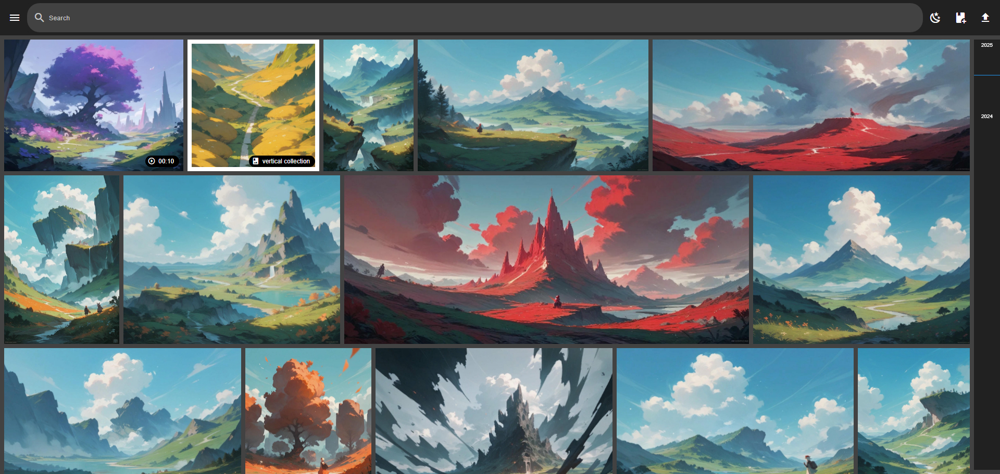

<!-- generated -->

# Urocissa

1-Click installation template for Urocissa on Easypanel

## Description

Urocissa is a self-hosted photo and video gallery designed to serve massive collections, capable of handling millions of images and videos. Built with Rust and Vue, it features blazing fast performance with an in-memory cached database that can instantly serve, search, and filter one million photos in under a second. It runs on as little as 4 GB of RAM even with a million photos, offers infinite scrolling without pagination using advanced virtual scrolling, and supports instant boolean search (and, or, not) across your entire library. Features include upload support, auto-sync from local folders, EXIF data extraction, user-defined tags, duplicate handling, shareable albums, and read-only mode.

## Instructions

Default password is generated automatically.

## Benefits

- Blazing Fast Performance: Built with Rust for the backend. Instantly serve, search, and filter one million photos in under a second using an in-memory cached database.
- Extremely Memory Efficient: Runs seamlessly on a 4 GB RAM server even with one million photos. Linear memory scaling (~1.2 GiB per million photos) ensures stability.
- Infinite Photo Stream: Experience endless scrolling without pagination. Advanced virtual scrolling overcomes browser DOM height limits for millions of items.
- Self-Hosted & Private: You own your data with no external cloud dependencies. MIT-licensed, privacy-focused, and secure with optional password protection.

## Features

- Instant Boolean Search: Use and, or, and not operators to search your data instantly. Find exactly what you need in milliseconds across your entire library.
- Upload & Auto-Sync: Upload photos and videos directly or configure sync paths to automatically watch local directories for new content.
- EXIF Data & Tags: Automatically extracts EXIF metadata from images. Add user-defined tags for custom organization and powerful filtering.
- Shareable Albums: Create and share albums with others. Supports read-only mode for public-facing galleries or demo instances.
- Duplicate Handling: Intelligent duplicate detection prevents redundant storage and keeps your library clean and organized.
- Video Support: Full support for video files alongside photos with integrated playback powered by FFmpeg.

## Links

- [Website](https://hsa00000.github.io/urocissa/)
- [GitHub](https://github.com/hsa00000/Urocissa)
- [Documentation](https://github.com/hsa00000/Urocissa/blob/main/docs/CONFIG.md)
- [Demo](https://demo.photoserver.tw)
- [Template Source](https://github.com/easypanel-io/templates/tree/main/templates/urocissa)

## Options

Name | Description | Required | Default Value
-|-|-|-
App Service Name | - | yes | urocissa
App Service Image | - | yes | hsa00000/urocissa:2.0.12
Password | - | no | 

## Screenshots

## Change Log

- 2026-03-02 – First Release (v2.0.12)

## Contributors

- [Ahson Shaikh](https://github.com/Ahson-Shaikh)
