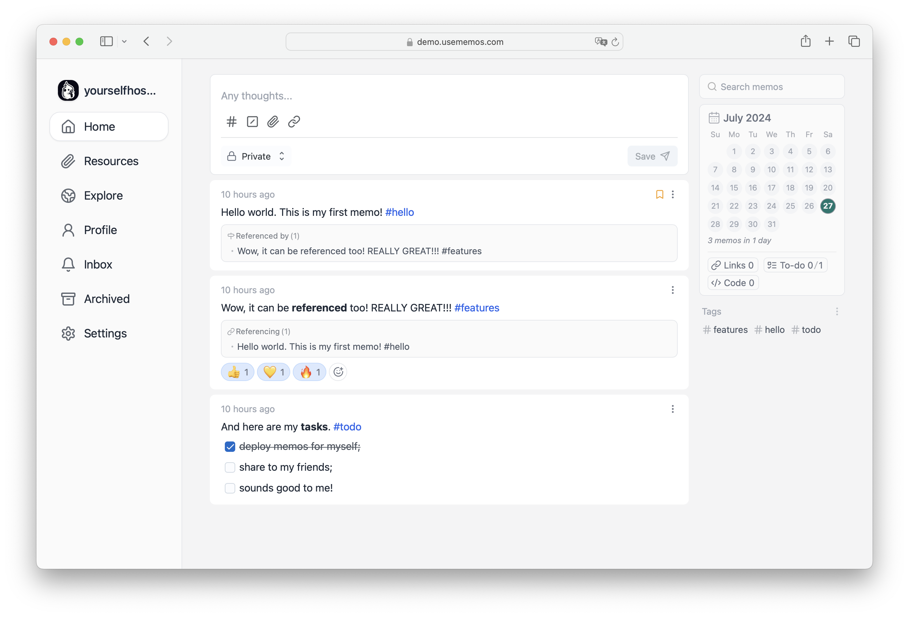

<!-- generated -->

# Usermemos

1-Click installation template for Usermemos on Easypanel

## Description

Usermemos is a lightweight, self-hosted note-taking application designed for simplicity, accessibility, and efficiency. It provides an intuitive interface for capturing and organizing memos with support for markdown formatting, tagging, and searching. This app is a Docker containerized version of Usermemos, making it easy to deploy and manage in various environments. The app supports multiple architectures, including x86-64 and arm64, and can be accessed via HTTP or HTTPS. It offers additional environment variables and configurations to enable customization. Usermemos is designed for both personal and collaborative usage, ensuring that users can manage their notes effectively.

## Benefits

- Self-Hosted Note-Taking: Usermemos is a self-hosted note-taking solution that ensures privacy and data ownership. Users have full control over their notes without relying on third-party cloud services.
- Lightweight & Fast: Designed with performance in mind, Usermemos runs efficiently with minimal system resources, making it ideal for both personal and business use.
- Multi-Platform Support: The app is compatible with multiple architectures, including x86-64 and arm64, ensuring broad deployment possibilities.
- Customizable & Extensible: Usermemos offers configuration options, allowing users to tailor the application to their specific needs, including theme customization and integration with external services.

## Features

- Intuitive Interface: Usermemos provides a clean and minimalistic interface, allowing users to focus on their notes without distractions.
- Markdown Support: The app supports markdown formatting, enabling users to structure their notes efficiently with headings, lists, links, and code snippets.
- Tagging & Organization: Users can categorize their notes using tags, making it easier to find and organize important memos.
- Search Functionality: A built-in search feature helps users quickly locate specific notes, improving efficiency and accessibility.
- Secure Access: The application supports authentication options to restrict access and enhance data security.
- Easy Deployment with Docker: Usermemos is containerized for quick and seamless deployment, simplifying the installation and management process.

## Links

- [Documentation](https://www.usememos.com/docs)
- [Github](https://github.com/usememos/memos)
- [Template Source](https://github.com/easypanel-io/templates/tree/main/templates/usermemos)

## Options

Name | Description | Required | Default Value
-|-|-|-
App Service Name | - | yes | usermemos
App Service Image | - | yes | neosmemo/memos:0.25

## Screenshots

## Change Log

- 2025-02-17 – first release
- 2025-07-25 – Version bumped to 0.25

## Contributors

- [Ahson Shaikh](https://github.com/Ahson-Shaikh)
